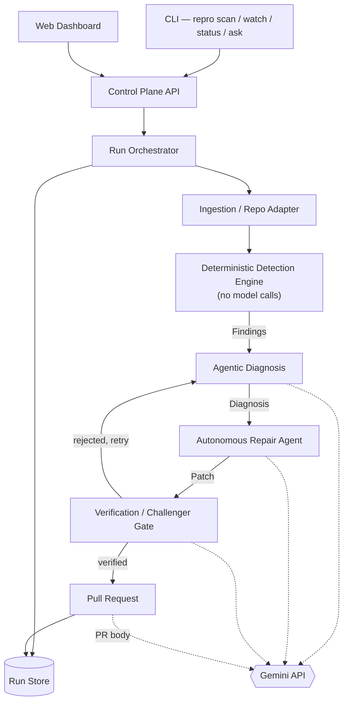

# Repro: Architecture, Execution Plan, and Team Guide

*Reference for the team, and project context for any Claude session working on Repro.*

## Contents

1. [What Repro is](#1-what-repro-is)
2. [Getting started](#2-getting-started)
3. [System architecture](#3-system-architecture)
4. [Core data contracts](#4-core-data-contracts)
5. [The pipeline in detail](#5-the-pipeline-in-detail)
6. [Working remotely: staying in the loop](#6-working-remotely-staying-in-the-loop)
7. [Status surface: CLI, API, web](#7-status-surface-cli-api-web)
8. [Adapting to challenges](#8-adapting-to-challenges)
9. [Safety rails](#9-safety-rails)
10. [Tech stack](#10-tech-stack)
11. [Team: four lanes](#11-team-four-lanes)
12. [36-hour timeline](#12-36-hour-timeline)
13. [Risks and mitigations](#13-risks-and-mitigations)
14. [Decisions, and what's left](#14-decisions-and-whats-left)

---

## 1. What Repro is

Repro is the 36-hour hackathon build of the same idea behind Affidavit: point AI agents at a codebase, ground every finding in deterministic, reproducible evidence, diagnose root causes, and repair the code with proof that the fix actually holds, not just a plausible-looking diff.

**Where it came from.** Two standing decisions from Affidavit carry over directly:

- **Grounded truth before reasoning.** A finding isn't a finding until it's reproduced against the running application or test suite, not merely pattern-matched by a model. The deterministic detection layer (section 5) exists specifically to give the agentic layers something true to reason about.
- **Proof-carrying repair.** A patch isn't done when the diff looks plausible. It's done when the original finding can no longer be reproduced, the test suite still passes, and a second, adversarial agent has tried and failed to poke a hole in the fix.

The underlying capability is general-purpose: grounded evidence about whether code is reliable, trustworthy, or efficient, whichever of those a given audience or challenge actually needs. By default, aimed at a developer's own project, that evidence reads as a list of things to fix. The Assurant challenge (section 8) pulls specifically on the trustworthiness facet, since that's the question an AI tool's own user is asking, but it's one of several focal points this generalizes to, not a redefinition of what the whole project is for.

**What's specific to building this in 36 hours:**

- **Contracts before code.** Four people can't hand four coding agents four different mental models and expect a working system at hour 30. The schemas in section 4 are frozen first; everything else is built against them in parallel.
- **Room to adapt, not rearchitect.** A newly revealed sponsor challenge gets built directly into whichever lane it actually belongs to, a new detector, a new piece of Diagnose's reasoning, a new dashboard view, or, when it's genuinely foundational, the ground itself (section 8), never by changing the pipeline's five stages or their order.

## 2. Getting started

### Software to install

| Software | Why |
|---|---|
| **Node.js 18+** | Needed for the standard npm install of Claude Code, and for any MCP servers or hooks that run over npx. |
| **Claude Code** | `npm install -g @anthropic-ai/claude-code`, or the native binary installer (`curl -fsSL https://claude.ai/install.sh \| bash` on macOS/Linux/WSL). Run `claude doctor` after install to confirm it's set up right. |
| **A claude.ai account, Pro or Max** | Authenticates Claude Code, and is specifically required for Routines and Dispatch (section 6). A Console API key alone won't reach those. |
| **A Gemini API key** | Create one in Google AI Studio and export it as `GEMINI_API_KEY`; the `@google/genai` SDK reads it automatically. Needed on Lane 3 and Lane 4 machines, plus the demo host (section 10). A package dependency, not a global install. |
| **Git 2.23+** | For cloning, branching, and the PR-based workflow every lane's repair patches go through. Confirm SSH or HTTPS credentials for GitHub are already set up. |
| **GitHub CLI (`gh`)** | Not strictly required, but repair PRs land directly on the target repo, so this makes opening, checking, and merging them from the terminal much faster. |
| **Semgrep and gitleaks** | Wrapped by Lane 2's detector adapters (section 10), and also run raw on stage for the demo's opening beat (section 8). Install both locally so the before-and-after can be shown from a plain terminal. |
| **Docker Desktop** (or Docker Engine on Linux) | For Repro's own architecture, not Claude Code itself: the sandboxed execution the safety rules require (section 9). |
| **WSL2** (Windows only) | Claude Code runs best inside WSL rather than native PowerShell or cmd. |

### Setup steps

1. Clone the Repro repo.
2. Install the software above; run `claude doctor` to confirm Claude Code is working.
3. Authenticate Claude Code with your claude.ai account.
4. Pair Dispatch: open Cowork on your phone and desktop, turn on Dispatch, and scan the QR code to link them (section 6 explains why this matters).
5. If you're on Lane 3 or Lane 4, create your own Gemini API key in AI Studio for development and export `GEMINI_API_KEY`. Separate keys spread free-tier quota across the team instead of four people draining one; the demo host gets its own billing-linked key (section 10).
6. Read section 4 (the contracts) before writing anything. It's the one file every lane depends on.
7. Confirm which lane you're on (section 11) and start there. Nobody installs a database locally, Lane 1 stands up one shared MongoDB Atlas cluster (section 10) and hands out a connection string.

## 3. System architecture

One control plane sits at the center: a Run Orchestrator that owns the idea of a "run" and moves it through five stages. The CLI, the web dashboard, the detectors, and the agents are all either clients of that control plane or workers it calls. Nothing talks to another module directly; everything goes through the contracts in section 4. Gemini sits outside the system as the reasoning engine the agentic stages call; Detect never calls it, and neither does anything else. A human sits at the other end of the diagram on purpose too: the only actor who can merge a repair PR (section 9).



**Components at a glance**

- **CLI**: runs a scan against a local path or a GitHub ref, or checks the status of a run already in flight.
- **Web Dashboard**: optional visualization layer over the same API (section 7 covers why it's optional and last).
- **Control Plane API**: the one typed surface everything else talks to.
- **Run Orchestrator**: moves a Run through its five stages and tracks state in the Run Store; triggered by the CLI, the API, or a schedule or webhook on a deployed instance.
- **Run Store**: MongoDB Atlas collections for Runs, Findings, Diagnoses, and Patches, the single source of truth for the CLI, the dashboard, and GitHub Checks alike.
- **Ingestion / Repo Adapter**: clones or mounts a target into a sandboxed workspace and builds a lightweight file index.
- **Executor**: the sandboxed command runner every stage that touches target-repo code depends on (section 4).
- **Deterministic Detection Engine**: runs the enabled detector adapters, no model calls, emits Findings.
- **Agentic Diagnosis**: Gemini explains and prioritizes Findings, never discovers new ones outside what a Finding ID backs.
- **Autonomous Repair Agent**: Gemini generates and applies a patch in the sandbox through function calls, re-runs tests and the originating detector.
- **Verification / Challenger Gate**: an adversarial Gemini pass that has to fail to disprove the fix, followed by a deterministic gate, before a Patch is eligible to become a PR.
- **Gemini API**: the only model provider the product calls at runtime. Every call goes through one thin wrapper in Lane 3's package (section 10), so model IDs, retries, and logging live in exactly one place. Claude Code remains the team's build tool (sections 2, 6); it is not part of the product.

## 4. Core data contracts

These are written to be read literally. Four Claude Code sessions working in parallel share nothing except what's written here, so where a field's meaning could reasonably go two ways, a semantics note underneath says which one is correct. Treat a semantics note as a hard constraint, not a suggestion, that's the reason it's spelled out rather than left to be inferred from the type.

Freeze all of it in the first two hours. No lane should ever need to know another lane's internals, only what's below. Two more things settle at the same freeze:

- **Written as Zod schemas, with TypeScript types inferred from them.** tRPC (section 10) wants Zod anyway, and Zod 4's `z.toJSONSchema()` turns a contract straight into the JSON Schema Gemini's structured output takes, so the schema Gemini sees can never drift from the contract below it. The interfaces in this section remain the spec either way; this is only how they get written down.
- **`Diagnosis.model` holds the exact model ID that produced it,** e.g. `gemini-3.1-pro-preview`, never a friendly name.

Two fields below are marked *pending*, not settled: decide on them at the freeze (section 14), don't leave it implicit.

### Pipeline data

```ts
// Emitted by a DetectorAdapter. No model involvement.
interface Finding {
  id: string;
  detectorId: string;        // "semgrep", "gitleaks", "custom-ast:null-deref"; matches DetectorAdapter.id
  ruleId: string;
  severity: "info" | "low" | "medium" | "high" | "critical";
  category: "vulnerability" | "inefficiency" | "correctness" | "style" | string;
  file: string;               // path relative to Workspace.path
  lineStart: number;
  lineEnd: number;
  message: string;
  evidence: string;          // exact snippet the claim is grounded in
  reproducible: boolean;
  reproductionCommand?: string;
  reproductionOutput?: string; // pending: verbatim Executor output that flipped `reproducible` to true
  createdAt: string;
}
```

**Semantics.** `reproducible` starts `false` the moment a DetectorAdapter emits a Finding, always, no exceptions. It is only ever flipped to `true` by actually running `reproductionCommand` through the Executor and confirming the result demonstrates the issue, never because a detector's own internal confidence is high, and never inferred by Diagnose or Repair. If no `reproductionCommand` exists, `reproducible` stays `false` indefinitely and Diagnose treats it as unconfirmed input, not as grounds for a fix. If adopted, `reproductionOutput` is the verbatim stdout/stderr excerpt from the ExecResult that flipped `reproducible` to `true`, written by the reproduction step and nothing else, never by a model, never edited afterward, and absent whenever `reproducible` is `false`.

```ts
// Emitted by the diagnosis agent. Must cite Finding IDs; nothing else is legal.
interface Diagnosis {
  id: string;
  findingIds: string[];
  rootCause: string;
  proposedStrategy: string;
  riskNotes: string;
  model: string;
  createdAt: string;
}
```

**Semantics.** `rootCause` and `proposedStrategy` may only describe what's true of the Findings in `findingIds`, their evidence, their file locations, their messages. The diagnosis agent may read surrounding code to write a coherent explanation, but nothing outside a cited Finding's locus is authoritative, and no new issues get introduced this way; a new issue is a new Finding, produced by Detect, not asserted here.

```ts
// Emitted by the repair agent, judged by the Verification / Challenger Gate.
interface Patch {
  id: string;
  diagnosisId: string;
  diff: string;
  filesChanged: string[];
  testsPassed: boolean;
  originalFindingReproduces: boolean;   // false == confirmed fixed
  reproductionOutputAfter?: string;     // pending: the same reproductionCommand, run after the patch
  regressionFindings: Finding[];        // new findings the patch introduced; should be empty
  challengerVerdict: "confirmed" | "disputed";
  challengerNotes?: string;
  status: "proposed" | "verified" | "rejected" | "merged";
  prUrl?: string;
}
```

**Semantics.** `diff` is a standard unified diff, the literal output of `git diff`, applying cleanly with `git apply` against `Workspace.headCommit`. It is never a natural-language description of the change and never a full-file replacement. `status` only ever advances `proposed` → `verified` → `merged`, or terminates at `rejected`; only the Verification / Challenger Gate may set `verified`, only a human merging the PR may set `merged`. If adopted, `reproductionOutputAfter` is the ExecResult excerpt from re-running the originating Finding's `reproductionCommand` against the patched workspace, captured by Repair's re-run and re-confirmed by Verify; it comes from the Executor, never from a model.

```ts
// Owned by the Run Orchestrator. One row per pipeline execution.
interface Run {
  id: string;
  trigger: "manual" | "schedule" | "webhook";
  target: { kind: "local" | "github"; ref: string };
  stage: "ingest" | "detect" | "diagnose" | "repair" | "verify" | "done";
  status: "queued" | "running" | "blocked" | "completed" | "failed";
  startedAt: string;
  logRef: string;
}
```

**Semantics.** `stage` reflects the pipeline stage currently in flight, not the last one completed; a Run showing `"repair"` means Repair is running now, not that Detect and Diagnose finished and nothing further has started.

### Execution and ingestion

Two more contracts sit underneath the pipeline data above: what Ingest hands off, and how anything downstream is allowed to touch code at all. Every lane that runs target-repo code, Detect's reproduction step, Repair, Verify, goes through these, never a raw shell call.

```ts
// Emitted by Ingest. Everything downstream reads from this; nothing touches the target repo's
// original location again once it exists.
interface Workspace {
  runId: string;
  path: string;               // sandbox-local path to the cloned/mounted code
  fileIndex: string[];        // every tracked file's path, relative to `path`
  languages: string[];        // detected languages present, e.g. ["typescript", "python"]
  headCommit: string;         // the exact commit the rest of the run is judged against
}
```

**Semantics.** `headCommit` is the single source of truth for "what code produced this Finding." If the target moves, a new commit lands upstream mid-run, this Run keeps working against its own `headCommit`; it does not silently pick up the new commit. `fileIndex` is a snapshot taken at ingest time; Detect does not re-walk the tree.

```ts
// The sandboxed command runner every stage that executes target-repo code depends on.
interface ExecRequest {
  workspacePath: string;      // from Workspace.path
  command: string;
  timeoutMs: number;
}

interface ExecResult {
  exitCode: number;
  stdout: string;
  stderr: string;
  timedOut: boolean;
  durationMs: number;
}
```

**Semantics.** Every invocation runs inside the ephemeral, network-restricted container from section 9, never on a teammate's machine or a shared host filesystem. A non-zero `exitCode` is not itself a failure signal for the Executor to interpret; the caller decides what its own command's exit codes mean (a linter's non-zero exit usually means "findings exist," not "the run broke"). One `ExecResult` per `ExecRequest`, no streaming, no partial results.

```ts
// The interface every wrapped scanner implements. The Detection Engine only ever calls this
// interface, never a specific tool's CLI directly.
interface DetectorAdapter {
  id: string;                                    // "semgrep", "gitleaks"; matches Finding.detectorId
  run(workspace: Workspace, exec: Executor): Promise<Finding[]>;
}
```

**Semantics.** An adapter translates a tool's native output into `Finding` objects; it does not filter by severity or otherwise editorialize, that judgment belongs to Diagnose. Every `Finding` an adapter returns starts with `reproducible: false`, per the rule above, regardless of how confident the underlying tool is.

## 5. The pipeline in detail

**Ingest.** The CLI or the web dashboard triggers a run against a target, local path or GitHub ref. The Repo Adapter clones or mounts the code into a sandboxed workspace and builds a lightweight file and dependency index so later stages never re-walk the tree.

**Detect.** The Deterministic Detection Engine runs every enabled detector adapter and emits a list of Findings. Nothing here calls a model, Gemini included: that's what makes everything Gemini does downstream credible, not something to give up to squeeze in one more model call. This stage is the grounded truth the rest of the system is not allowed to contradict: the model's job downstream is explanation and prioritization, never discovery. Immediately after, the reproduction step runs each Finding's `reproductionCommand` through the Executor; the ones that demonstrate the issue flip to `reproducible: true` and, if adopted, keep the output as `reproductionOutput`.

**Diagnose.** The diagnosis agent receives a batch of Findings, never raw source on its own, only Findings plus the minimal code context each one points to, and produces Diagnosis objects. The prompt contract forbids raising an issue that isn't backed by a Finding ID.

On Gemini:

- **Model.** The Pro tier with `thinking_level: "high"` (section 10). Root-cause reasoning is where a stronger model visibly pays off.
- **Context.** Gemini's long context means "the code context each Finding points to" can be the whole enclosing file, plus the files along a source-to-sink path for a taint finding, rather than a ten-line window, which is what lets it see that several Findings share one root cause. The locus rule above still holds: surrounding code informs the explanation, and is never grounds for a new issue.
- **Citations enforced at decode time, not just by prompt.** The response schema is built per call, with `findingIds` constrained to an `enum` of exactly the IDs in this batch, so structured output can't emit an ID that isn't there. A deterministic post-check re-validates anyway (a Zod parse, every diagnosis cites at least one ID). A failure is retried once, then dropped and logged.
- **Unconfirmed stays unconfirmed.** Findings with `reproducible: false` are labeled unconfirmed in the prompt. Gemini may explain them, but a Diagnosis only moves on to Repair if every Finding it cites is `reproducible: true`.
- **Optional external references.** With the `google_search` and `url_context` tools enabled, Diagnose can cite CWE entries, OWASP guidance, or a package's own advisory in `riskNotes`. A reference can justify a strategy; it can never introduce an issue, and the schema has no field it could use to try. Combining built-in tools with structured output is a Gemini 3 preview feature; if it misbehaves, turn the tools off, not the schema.

```ts
import { GoogleGenAI } from "@google/genai";
import * as z from "zod";

const client = new GoogleGenAI({}); // reads GEMINI_API_KEY

// Built per call: findingIds can only be IDs that are actually in this batch.
function diagnosisResponseSchema(batchIds: string[]) {
  return {
    type: "object",
    properties: {
      diagnoses: {
        type: "array",
        items: {
          type: "object",
          properties: {
            findingIds: { type: "array", items: { type: "string", enum: batchIds } },
            rootCause: { type: "string" },
            proposedStrategy: { type: "string" },
            riskNotes: { type: "string" },
          },
          required: ["findingIds", "rootCause", "proposedStrategy", "riskNotes"],
        },
      },
    },
    required: ["diagnoses"],
  };
}

const schema = diagnosisResponseSchema(batch.map((f) => f.id));
const interaction = await client.interactions.create({
  model: process.env.REPRO_MODEL_DIAGNOSE ?? "gemini-3.1-pro-preview",
  system_instruction: DIAGNOSE_SYSTEM_PROMPT,
  input: renderDiagnosePrompt(batch, codeContext),
  generation_config: { thinking_level: "high" },
  response_format: { type: "text", mime_type: "application/json", schema },
});
const { diagnoses } = z.fromJSONSchema(schema).parse(JSON.parse(interaction.output_text));
```

**Repair.** The repair agent takes a Diagnosis, generates a patch, applies it inside the sandboxed workspace, and runs the project's own test command plus a re-run of the specific detector and reproduction command that raised the original Finding, keeping that re-run's output as `reproductionOutputAfter` if the field is adopted.

On Gemini:

- **Model.** The Flash tier with `thinking_level: "high"`. Repair makes many calls per patch, so this is where speed and quota matter most.
- **It works through function calls.** Gemini gets `read_file`, `replace_in_file`, `run_tests`, `rerun_detector`, and `finish`. File tools are path-checked against `Workspace.path` and `fileIndex`; anything that executes goes through the Executor. Gemini's own built-in code-execution tool is never enabled: it runs in Google's environment rather than our container, and can't see the workspace anyway.
- **Gemini never writes the diff.** It edits files through tools. When it calls `finish`, the harness runs `git diff` against `Workspace.headCommit`, and that output becomes `Patch.diff`. Section 4's "literal output of `git diff`" holds by construction, instead of depending on a model formatting a unified diff correctly.
- **One conversation per attempt.** Each turn chains with `previous_interaction_id`, so history lives server-side and the stable prefix hits implicit caching. `tools`, `system_instruction`, and `generation_config` are per-interaction, not carried forward: re-send them every turn, or the next turn silently runs without them.
- **Hard caps.** 15 tool calls per attempt and 2 attempts per Diagnosis, counting the verify-to-diagnose retry edge. Past that, the Patch is `rejected` and the Run moves on.

**Verify.** An adversarial challenger agent, a second and differently-prompted pass, whose only job is to try to disprove the patch: does the original Finding still reproduce, did the patch introduce a new one, does it change behavior the tests don't cover. Only a Patch with status `verified` becomes a PR.

On Gemini:

- **A different model, on purpose.** The Challenger runs on the Pro tier while Repair runs on Flash, under an adversarial system instruction. It sees the Findings, the Diagnosis, the diff, and the deterministic results, and never the repair agent's conversation, so it can't inherit the reasoning it's supposed to attack.
- **It attacks with code, not opinions.** Its main tool is `run_counter_test`: it writes a test it expects the patch to fail, and the Executor runs that test against both `headCommit` and the patched workspace. Both outcomes go into `challengerNotes`. Fails before and passes after means the fix survived that attack. Fails both times means the hole is still open. Passes before and fails after means the fix broke something that used to work.
- **Structured verdict.** The final answer is `{ verdict: "confirmed" | "disputed", notes }`, validated like Diagnose's output. Function calling plus structured output in the same interaction is also a Gemini 3 preview feature; if it's flaky, run the tool loop first and make one final call with the schema and no tools.
- **Gemini doesn't set `verified`.** The gate is plain code: `verified` only when `testsPassed`, `!originalFindingReproduces`, `regressionFindings` is empty, and `challengerVerdict === "confirmed"`. Gemini supplies one of those four inputs. A dispute always blocks, and its notes feed the retry.

## 6. Working remotely: staying in the loop

This isn't a feature of Repro the product. It's how the four of you actually work on building it.

**What this solves.** Your normal mode is architect and reviewer: you set direction, Claude Code implements, you check in and redirect. The hackathon adds one constraint, you can't always be at your laptop, sponsor fairs, sleep, whatever else the 36 hours demands. Routines and Dispatch let you stay in that same loop from your phone instead of stepping out of it. This is about staying the active decision-maker while untethered, not about letting agents run unsupervised.

**Dispatch is your main channel.** It's a Cowork feature: one persistent thread you reach from your phone, connected to your Desktop app. Assign a piece of work, walk away, and Claude works on it there; when it finishes, hits a decision point, or has a question, it shows up in the thread and you reply with a confirmation or a new instruction, the same exchange you'd have at your desk. Development tasks in that thread run as a Claude Code session underneath.

Setup: open Cowork on desktop, turn on Dispatch, follow the prompts for file access and keeping the computer awake, then scan the QR code from the Claude mobile app to pair the two. One thing worth planning around: your desktop has to stay awake with the app open for Dispatch to reach it. Nothing happens if the laptop's asleep or closed.

**Routines are for the well-defined, recurring pieces.** A routine is a saved prompt-plus-repo configuration that runs on a schedule, an API call, or a GitHub event, hourly at minimum, on Anthropic's own infrastructure rather than your machine, so it keeps going even with your laptop closed. It's a worse fit for live back-and-forth and a better one for things like "check whether lane 2's branch still merges cleanly every hour" or "kick off verification whenever a repair PR opens." Use these for the pieces that genuinely don't need your judgment each time, and keep Dispatch for the ones that do. Routines never hold the Gemini key; anything a routine runs uses a mocked wrapper instead (section 10).

**Remote Control, worth knowing about.** For watching and approving a live session step by step from your phone, closer to sitting at the keyboard remotely than Dispatch's assign-and-check-back pattern, this is the closer fit. It also needs your machine awake.

**A secondary benefit, not the point of this.** Because a routine retries automatically on its next scheduled tick if it hits a usage limit mid-run, anything set up as a routine naturally shrugs off a usage window without anyone noticing. Convenient, but not why this exists; the reason is staying reachable and in control, not running unattended.

**Guardrails that still apply.** Whatever does run through a routine unattended should have its permissions pre-approved, so nothing silently stalls waiting for a click that isn't coming, and a clear stop condition in its prompt. Section 9 covers the rest.

### Commit conduct

This governs how Claude Code commits, pushes, and merges while building Repro itself. Section 9's stricter rule, a human always merges, still governs Repro's own product behavior against target and demo repos, unchanged. Two different repos, two different stakes, two different rules.

**Committing.** One logical change per commit; if a change can't be described in one sentence, it's two commits. Message format: `<lane>: <what changed>`, lowercase, imperative mood, no period, for example `lane-2: wrap gitleaks output as Finding[]`. No commit lands with failing tests or a broken build, a commit is a checkpoint, not a work-in-progress marker. Never commit directly to `main`; every commit lands on that lane's own branch, or a short-lived sub-branch off it.

**Pushing.** Push after every commit that leaves the branch in a working state, don't batch a day's work into one push at the end. Push only to the lane's own branch or a sub-branch of it, never to `main` directly, from any lane, ever. A push that would force-overwrite another session's unmerged work on the same branch stops and flags it in the Dispatch thread rather than resolving it unilaterally.

**Branches.** Each lane owns exactly one long-lived branch, named `lane-1` through `lane-4`, matching its commit message prefix. Default to committing directly on it; spin up a short-lived sub-branch, named `lane-N/<short-topic>`, only for something risky enough that it shouldn't land on shared lane history until it's working, and merge that back into the lane branch, never straight to `main`, the moment it's done, then delete it. Sync a lane branch against `main` by merging `main` in, never by rebasing, rebasing means force-pushing history another session might already be working from, which the push rule above already rules out. If that merge doesn't resolve cleanly, stop and flag it in the Dispatch thread rather than resolving it unilaterally, same as a conflicting push.

**Cadence.** Commit and push at least once per hour of active work, and immediately after completing any unit of work that leaves things in a working state, whichever comes first. Long silent stretches followed by one large commit are exactly what makes remote supervision pointless, there's nothing to react to until it's already big. Follow this cadence without being asked each time; it's a standing rule, not a per-task instruction.

**Merging.** A lane may merge its own branch into `main` on its own, autonomously, once the build passes, tests pass, and the PR touches nothing in `@repro/contracts`. Any change that touches the contracts package, regardless of size, stops short of merge and waits for a confirmation through Dispatch, every other lane depends on that package, so this is the one place autonomy yields to a human on purpose.

**PR descriptions.** Title only, no body, unless the change touches the contracts package, in which case one line saying what changed and why. Never restate the diff in prose, the diff is the description. No what/why/how templates, no bullet-pointed feature lists, no generated changelog prose. If a title doesn't say enough on its own, that's a sign the commit should have been split, not that the PR needs more writing. This is the rule for the team's own PRs on Repro; the repair PRs Repro opens on target repos are the opposite case, their body is the product (section 8).

## 7. Status surface: CLI, API, web

Build the API and Run Store, plus a CLI `repro status` command, first, as the single source of truth. That alone gives two working status surfaces (the CLI, and GitHub Checks or PR comments) with zero dedicated UI work, and it's a stronger demo beat than it sounds: judges see real PRs, not a UI that might be hiding a mock underneath.

Layer the web dashboard on top of that same API once the pipeline is real, because a dashboard is the one thing every other team at the hackathon will also have; it should never be where your differentiation lives. If the dashboard lane finishes early, spend the extra time on live updates over the same data rather than new screens.

A real alternative worth deciding on purpose: since PRs and GitHub Checks already show status, some teams skip a custom web UI entirely and let the PR itself be the product surface. Worth deciding rather than assuming, since it changes the whole workload of the dashboard lane. A PR carrying a full proof block, evidence, before-and-after reproduction if adopted, test results, the challenger's verdict, makes that option stronger than it looks; Gemini's PR narrator (section 8) writes the prose half of it.

One exception to all of that: the Trust Report view from the Assurant challenge (section 8) is real differentiation, not decoration. That one's worth building even if the rest of the dashboard stays thin.

## 8. Adapting to challenges

Two of the four sponsor challenges below are additive; two are foundational. None needed a bolt-on. What "modular" actually means for Repro isn't a plugin system sitting beside the real architecture, it's that the real architecture already has enough genuine extension points that a new challenge usually lands as an ordinary addition to something that already exists, not a special case kept at arm's length from it.

- **A new kind of finding** goes to lane 2, another `DetectorAdapter` in the same set Semgrep and gitleaks already belong to (section 4). Nothing about the Detection Engine or the Finding contract changes to accommodate one, that's what the contract was already for.
- **A new kind of reasoning about a finding** goes to lane 3, part of how Diagnose actually thinks, not a toggle sitting outside it. Assurant's trust framing isn't a switch Diagnose flips for some findings, it's simply what Diagnose does when a finding calls for explaining a consequence to someone who isn't a developer.
- **A new way of showing a result** goes to lane 4, another view in the dashboard, built the same way the Run view or the Findings list already is.
- **A change to what any of this runs on** is foundational, and gets built as one, the way MongoDB Atlas and Gemini (below) became the Run Store and the reasoning engine rather than something layered on top of them.

None of the four above touch the orchestrator, the pipeline stage order, or the shape of the five stages themselves. That's the actual property "modular" was protecting: room for challenge-driven features to land somewhere real without a rearchitecture, not a separate system for keeping them apart from the real one.

### Take Control of AI (Assurant)

The first sponsor challenge revealed. It asks for something that gives people real control over their use of AI: privacy protection, spending visibility, or confident tool selection. Point a run at an AI-powered tool's source instead of an arbitrary codebase, and the pipeline answers the trustworthiness facet of the same question it always asks (section 1): does this deserve your trust, backed by evidence, not a badge.

Three real pieces, one per lane:

- **`privacy-patterns`** (lane 2, a `DetectorAdapter` alongside Semgrep and gitleaks): a Semgrep rule pack looking for what actually matters for trusting an AI tool with your data, user input forwarded to an undisclosed third-party endpoint, prompts or responses logged or persisted without redaction, missing encryption on local storage of conversation history, OAuth scopes broader than the tool's stated functionality needs. Gitleaks findings feed into this too, a hardcoded provider API key erodes trust the same way a privacy leak does.
- **Trust framing in Diagnose** (lane 3, part of the diagnosis prompt itself): when a Finding comes from `privacy-patterns` or gitleaks, Diagnose still cites only what the Finding's evidence shows, same rule as everywhere else, but its explanation includes the plain-language consequence for a non-technical reader, what this means for someone's data, not just what the code does wrong.
- **A Trust Report view** (lane 4, a real page in the dashboard, not a toggleable panel): a consumer-legible summary, a plain count like "3 of 4 privacy checks passed," where every claim still links back to the Finding and evidence behind it. The pitch is that it isn't a vague trust badge, it's the same proof-carrying standard the rest of Repro already holds itself to.

The challenge's third prong, spending visibility, isn't part of this. It doesn't fit Repro's shape without inventing an unrelated feature, and stretching to cover all three would dilute the two that are a genuine, evidence-backed fit.

### Best Use of Gemini API (Google Cloud)

Revealed early enough to design in from hour 0 rather than bolt on later: Gemini becomes Repro's reasoning engine, not an add-on to it. Every model call the product makes at runtime, Diagnose, Repair, the Challenger, goes to the Gemini API; which model and why is a tech-stack decision (section 10), foundational in the same spirit as MongoDB. Detect stays model-free regardless: grounded truth before reasoning still holds, and a model call asking Gemini to "scan" for issues would be exactly the model-authored Finding that stage exists to prevent.

One more piece is genuinely additive, and lands in lane 4 like any other new view:

- **The PR narrator.** When a verified Patch becomes a PR, Gemini (Flash, low thinking) writes the body: the root cause in plain English, why this fix over the alternatives, what the Challenger tried. The deterministic evidence is pasted in verbatim beside it, never paraphrased, and Gemini's prose is labeled as Gemini's.

The pitch in one line: **Gemini proposes, the sandbox disposes.** Every Gemini output that matters gets checked by something deterministic, a schema, `git diff`, the test suite, a detector re-run, a counter-test run, before it counts for anything.

### The Microsoft challenge: a person doing a real task, no chatbot core

The brief, condensed: build something that helps someone do a task they couldn't easily do before, AI as part of the experience, not the whole of it. Two hard rules, not suggestions: the core experience can't be a chatbot or depend on a chat window, and the demo has to show a person accomplishing something real, not asking AI a question.

Repro's answer leans on what it already is rather than adding anything: someone inherits code they didn't write, Repro reproduces what's actually wrong, fixes it, proves the fix, and the person reads the proof and merges. That's the task. Two contract fields, pending confirmation at the freeze (section 4), make the proof itself visible rather than asserted: `Finding.reproductionOutput` (the "before") and `Patch.reproductionOutputAfter` (the "after").

**The standing rule this challenge adds: no chat surface, anywhere.** Not the CLI, not the dashboard, not an "ask about this finding" box. The person's inputs are a target ref and merge-or-reject on a PR, nothing else. If a feature needs a prompt box to work, it's the wrong feature for this build. This is stricter than section 9's general prompt-injection stance: it isn't just that free text is treated as untrusted, it's that a person-facing free-text box doesn't exist at all. Repro doesn't have one anywhere, Ask Repro was dropped from the Gemini challenge's feature set specifically to keep it that way.

### The demo

Gemini's judging and the Microsoft challenge's judging ended up wanting almost the same script, for different reasons: Gemini's judges want to see the model do the interesting parts and something deterministic check each one; the Microsoft challenge's judges want to see a person accomplish a real task, not watch a pipeline run. One script serves both, narrated differently depending on who's in the room, written before any code, in hour 0 to 2 (section 12), and treated as the acceptance test for everything that follows.

**The beats.**

1. **Before.** Semgrep and gitleaks, raw and unfiltered, on a seeded repo. Hundreds of lines, no ranking by what's real. Ten seconds, no commentary needed.
2. **`repro scan`.** The count collapses from everything a scanner flagged to what the reproduction step actually confirmed. Say the numbers once.
3. **Diagnose.** A Diagnosis citing several Finding IDs under one root cause, the model ID shown beside it.
4. **Repair, live.** Tool calls scroll past: read, edit, run tests, re-run the detector.
5. **The Challenger disputes a fix.** The strongest beat, rehearse it: a first patch fails the counter-test, gets sent back, and the retry passes the same test. Two agents disagree and something deterministic settles it. It won't happen on every run; the fallback video (section 12) carries it if the live run gets a clean fix on the first try instead.
6. **The PR.** Opens with the full proof block and, if adopted, a Gemini-written narration beside the verbatim evidence. A person reads it and merges. That click is the task being accomplished, by them, not by Repro.
7. **After.** Re-run the reproduction command, or `repro scan`, against the merged branch. The issue is gone. Shown, not claimed.

**What not to do.** Don't open on the architecture diagram. Don't demo Dispatch or Routines, those are how the team built this (section 6), not the product. Don't narrate; let a teammate play the person inheriting the repo, honestly, for those six minutes.

## 9. Safety rails

- Every sandboxed execution (a target repo's build, its tests, or the repair agent's shell commands) runs in an ephemeral, network-restricted container, never on a teammate's machine or a shared runner's host filesystem directly.
- Agents never push to main and never merge their own PRs. A verified Patch is necessary, not sufficient; a human still clicks merge.
- The contracts package is a protected path, branch protection or a CODEOWNERS entry requires human review on anything that touches it.
- Any target-repo credential is scoped to the minimum needed, used only at the PR-opening step, and never handed to a model as a raw secret it could echo back or leak into a commit.
- **A leaked secret never reaches a model either.** gitleaks runs with `--redact`, so a real secret's value never lands in a Finding's `evidence`, in `reproductionOutput`, the Run Store, the dashboard, or a prompt to Gemini or any other model.
- **The only free text any model reads is the target repo's own contents and detector output, and both are treated as untrusted.** Instructions found in code, comments, or commit messages are never followed; nothing a model produces runs anywhere except inside the Executor's container.
- **Model API keys are runtime secrets,** handled like `MONGODB_URI`: an env var only, never in the repo, a prompt, or a log.
- **A model's own built-in code execution, where it has one, stays off everywhere.** Target-repo code runs only in Repro's own container, through the Executor, never in a provider's environment that can't see the workspace anyway.
- **Mind what a free tier does with prompts.** Check the Gemini API terms before pointing Repro at anyone's private code: on unpaid usage, Google may use submitted content to improve its products. Seeded demo repos are fine on a free key; real target repos go through the billing-linked one.
- Anything run as a routine gets pre-approved permissions and an explicit stop condition (section 6), so it can't stall waiting on you, or keep going past the point where it should have stopped, while you're not watching.
- Every run's full prompt and tool-call log is retained, so a human can always answer "why did it do that." Don't rely on a provider's own server-side interaction storage for this, Gemini's free tier keeps interactions for one day; write the log to the Run Store yourself.

## 10. Tech stack

**Reuse as-is.** TypeScript across the board; a Docker-first sandbox for anything executing target-repo code; React with Vite if the dashboard gets built. Common, well-supported choices, fast to stand up without anyone needing to learn something new first. The Run Store itself, below, is a foundational decision made fresh for Repro, not carried over from anywhere.

**MongoDB Atlas is the Run Store: a foundational decision.** Best Use of MongoDB Atlas is the second sponsor challenge, and like Assurant, it's built directly into the architecture (section 8), here that means the persistence layer itself rather than a detector, a piece of reasoning, or a view. One shared cluster still matters for the same reason a shared database always would: Atlas's free tier, or the $50 MLH student credit if its limits get tight, covers a single cluster everyone reaches over one connection string, nobody's laptop has to stay awake to keep it alive. The Findings, Diagnoses, and Patches from section 4 store as documents rather than rows, which fits `Patch.regressionFindings` (an embedded array of full Finding objects) and `Finding.category`'s open-ended string more naturally than a relational schema would have. The contracts themselves don't change, `id` stays a plain string the API layer generates, Mongo's own `_id` is an internal storage detail that never leaks past the Run Store. Nobody installs anything locally; the only thing on each machine is a `MONGODB_URI` env var and the Mongoose client the API package depends on.

**Trim for 36 hours.** Skip WorkOS AuthKit, a single shared demo token or no auth at all is fine for a hackathon. Skip Graphile Worker, a plain in-process queue or a polling loop over the Run Store is enough at this scale. Skip Fly.io and R2 unless those accounts are already warm; a single Docker Compose stack on a free-tier host, or just localhost plus a tunnel for the live demo, is faster to stand up.

**Keep even while trimming.** Fastify with a thin tRPC layer means the dashboard and CLI share one typed client with almost no boilerplate.

**Detectors: wrap, don't build.** Confirmed: speed, wrap Semgrep and gitleaks rather than build detection logic from scratch. Semgrep's rule sets cover both JavaScript/TypeScript and Python natively, so one detector adapter buys the security and correctness sweep across the whole target surface; gitleaks is language-agnostic for secrets. No separate per-language linter needed at this scope. Wrapping the same tools a person would run by hand is also what makes the demo's first beat honest: the "before" and the "after" come from the same scanners.

**Model provider: Gemini, through `@google/genai` and its Interactions API.** `npm install @google/genai`, call `client.interactions.create(...)`; Google now calls the older `generateContent` API legacy, it still works, don't mix the two. One thin wrapper in Lane 3's package (`@repro/agents`, `src/gemini.ts`) is the only file that imports the SDK: it owns model routing, structured-output parsing (Zod, section 4), retry with backoff on 429 and 5xx, and writing every interaction to the run log. Lane 4's PR narrator calls that same wrapper, never the SDK directly.

| Role | Default model | Thinking | Why |
|---|---|---|---|
| Diagnose | `gemini-3.1-pro-preview` | high | Root-cause reasoning is where a stronger model visibly pays off |
| Challenger | `gemini-3.1-pro-preview` | high | Adversarial pass, deliberately a different model from Repair |
| Repair loop | `gemini-3.8-flash` | high | Many calls per patch; speed and quota matter most here |
| PR narrator | `gemini-3.8-flash` | low | Latency matters more than depth |

Every model ID comes from an env var (`REPRO_MODEL_DIAGNOSE`, `REPRO_MODEL_CHALLENGER`, `REPRO_MODEL_REPAIR`, `REPRO_MODEL_NARRATOR`) with the defaults above. The Pro tier is a preview; if its quota is tight on your keys or it changes mid-hackathon, point both Pro variables at `gemini-3.8-flash` and nothing else moves. Re-check these IDs against Google's models page at hour 0, they were current as of September 2026.

**Budget governance.** Two separate bills, and they don't mix.

- *Building Repro, Claude.* About $100 in usage credits funds this. Which billing surface it sits on matters: Routines and Dispatch (section 6) draw on a claude.ai subscription's usage, not a Console API key, so Console pay-as-you-go credit won't reach them at all. Whatever does run unattended as a routine, default it to a Sonnet-class model, reserve an Opus-class model for the steps that actually need the extra reasoning, and cache the contracts and architecture context that gets re-sent often, since repeated large inputs are the dominant cost driver.
- *Running Repro, Gemini.* Every model call the product itself makes bills to a Gemini key. The free tier is enough to develop against, especially with each developer on their own key (section 2). The demo host needs a key on a billing-linked project, Tier 1 takes effect as soon as billing is linked, and a 429 on stage is the likeliest way to lose the live demo. Check each model's real rate limits on AI Studio's page at hour 0, and ask whether the event hands out Google Cloud credits.
- *Caching.* The Interactions API's implicit caching is automatic past roughly 4,096 tokens on these models, nothing to manage, only an ordering rule: stable content first (system instruction, the contracts excerpt, file context), per-call content last (this batch's Findings, the latest tool result).
- *Tests.* Unit tests mock the Gemini wrapper. Only integration checkpoints and demo runs hit the real API, and routines never do.

Track real spend on both once runs start; token use per task varies enough that any estimate here is a starting point, not a budget.

## 11. Team: four lanes

Each lane's only shared dependency is the contracts package and the Run/Job API, frozen in the first two hours so all four of you can work in parallel without waiting on each other. Each of you pairs your own Dispatch thread (section 6), so lane ownership and remote-supervision channel are the same split.

**Lane 1: Contracts and orchestrator.** Owns `@repro/contracts` (Finding, Diagnosis, Patch, Run, Workspace, Executor, and the DetectorAdapter interface) and the Run Store schema, written as Zod schemas so Lane 3 can derive Gemini's response schemas from them directly (section 4). Also sets up the demo host's billing-linked Gemini key (section 10). Unblocks everyone else, so it stabilizes first, then this person can float to support the others as new challenges get built directly into whichever lane they belong to.

**Lane 2: Ingestion and deterministic detection.** The Repo Adapter (local clone and GitHub clone, producing the Workspace contract), Semgrep and gitleaks wrapped as DetectorAdapters, and the reproduction step, run through the Executor, that's the only thing allowed to flip a Finding's `reproducible` to `true` and, if section 4's pending fields are adopted, the only thing that writes `reproductionOutput`. gitleaks runs with `--redact` (section 9). Every Semgrep Finding's `reproductionCommand` should be a re-run of that one rule against that one file, so Repair and the Challenger have a deterministic "does it still reproduce" to lean on.

**Lane 3: Agentic diagnosis and autonomous repair.** Prompt design for Diagnose (must cite Finding IDs, forbidden to invent findings, and, per section 8, translate one into a plain-language consequence when the audience is a person deciding whether to trust a tool rather than a developer fixing it), the repair agent, running tests and detector re-checks through the Executor and, if adopted, capturing `reproductionOutputAfter`, the adversarial challenger agent, and the verification gate. All of it runs on Gemini: the `@repro/agents` wrapper, per-call response schemas, the function-calling repair loop, and the Challenger's counter-tests (sections 5, 10). The AI core of the project, the most central to the pitch, and now the lane two separate sponsor challenges run through.

**Lane 4: Status surface.** The Fastify/tRPC API, Run Store queries, and, if time allows past section 7's recommendation, the web dashboard: live run view, Findings/Diagnosis/Patch visualization, the Trust Report view (section 8), a before-and-after view if the pending proof fields are adopted, plus GitHub PR and Checks integration as the always-available fallback surface. Adds the PR narrator (section 8). Also holds the no-chat-surface rule wherever it applies: any text input that isn't a ref or a toggle gets flagged in review.

## 12. 36-hour timeline

| Window | Milestone |
|---|---|
| Hour 0 to 2 | All four together: finalize contracts and Run schema, including a decision on the two pending proof fields (section 4), scaffold the monorepo, get Claude Code authenticated and Dispatch paired on every machine, write the demo script (section 8) before any code, and pick or seed two or three demo repos with known, reproducible issues, planting at least one bug whose obvious fix is wrong so the Challenger has something real to catch. Also: Gemini keys created and one smoke test passing on every machine that needs one, real rate limits checked, billing linked for the demo key. |
| Hour 2 to 10 | Parallel build. Each lane builds against the frozen contracts and mocked data for whatever it doesn't own yet; nobody blocks on anybody. Lane 3 builds the Gemini wrapper and a real Gemini Diagnose against mocked Findings from the start; there's no stubbed-model phase to replace later. |
| Hour 10 to 14 | First integration checkpoint: a real end-to-end pass on a seeded repo, Ingest through Detect through a real Gemini Diagnose and a stubbed Repair. Ugly is fine; wired-together is the goal. |
| Hour 14 to 24 | Deepen every stage: real diagnosis prompts, the Gemini repair loop and Challenger counter-tests, live dashboard updates if built. |
| Hour 24 to 28 | Second integration checkpoint, and the first full run of the demo script (section 8) with a teammate playing the person. Also the reserved window for whatever challenge gets revealed next, or for the PR narrator if it didn't make it in earlier, built directly into whichever lane it belongs to, the same way Assurant, MongoDB, and the rest already were. |
| Hour 28 to 32 | Polish, error handling, curate the final demo repo, record a fallback video of a full clean run in case something's flaky on stage. The video has to show the Challenger's dispute and retry, not just the final PR. |
| Hour 32 to 36 | Buffer, code freeze, rehearse the demo as a task (nobody narrates architecture), prep submission materials. Opt into whichever sponsor prizes apply when submitting, and for Gemini, name the specific features used in the write-up: structured output, function calling, thinking levels, long context. |

## 13. Risks and mitigations

| Risk | Mitigation |
|---|---|
| Nobody on the team has used Mongoose or MongoDB Atlas before | Keep the schema deliberately flat, close to a 1:1 match with the section 4 contracts, and skip aggregation pipelines and transactions entirely, there's no hackathon-scale reason to need either. |
| A hallucinated finding reaches a PR | The grounding contract forbids uncited findings; Diagnose's schema can only emit IDs that are actually in its batch; the challenger agent blocks any unverified patch from becoming a PR. |
| Four lanes' work merge-conflicts | Lane-scoped branches, a protected contracts package. |
| One person's usage limit slows their lane mid-build | Each teammate authenticates independently, so one person's limit doesn't stop the others; keep a rehearsed fallback video of a full pipeline run for the live demo regardless. |
| Autonomous repair breaks the target or demo repo | Everything sandboxed and PR-gated, never a direct push; demo against seeded repos that have already been dry-run. |
| Scope creep from late-revealed challenges | Section 8's rule: a new detector, a piece of Diagnose's reasoning, or a dashboard view for whichever lane it belongs to; a standing review rule that anything touching the orchestrator or the pipeline stage order gets questioned before it merges. |
| Gemini rate-limits (429) during the live demo | Billing-linked key on the demo host, backoff in the wrapper, the fallback video. |
| The Gemini Pro preview model is throttled or changes mid-hackathon | Model IDs live in env vars; point the Pro roles at `gemini-3.8-flash`. |
| Gemini produces a malformed diff | It can't, by construction: Gemini edits through function-call tools and `git diff` produces `Patch.diff`, never the model's own text. |
| Gemini "finds" a new issue while diagnosing | No schema field can carry one; `findingIds` is enum-constrained to the current batch, and Detect is the only source of Findings. |
| Structured output combined with tools misbehaves (a Gemini 3 preview trait) | Drop the tools for that call, or split into a tool loop followed by a final schema-only call. |
| Gemini looks like a wrapper around scanners, not the star | The demo script (section 8) puts Diagnose's grouping and the Challenger's dispute on screen, not just the final PR. |
| Judges read Repro as an AI assistant with extra steps | No prompt box anywhere the no-chat-surface rule applies (section 8); the demo opens on the person and the repo, not the pipeline; every model output on screen sits beside the deterministic evidence that grounds it. |
| The demo shows a pipeline running, not a person doing a task | The script (section 8) ends with a human merge and a re-run proving the issue's gone, rehearsed with a teammate playing the person, never a developer narrating architecture. |

## 14. Decisions, and what's left

Answered, and folded into the sections above:

- **Target ecosystems:** JavaScript/TypeScript and Python, both from v1 (section 10).
- **Lane assignment:** the section 11 split stands as written.
- **Repo access:** a plain local clone for ingestion (section 3).
- **Where repair PRs land:** directly on the target repo (sections 6, 9).
- **Remote supervision:** not a demo talking point, this is how the team actually works during the 36 hours, staying the active decision-maker via Dispatch, with Routines for the well-defined recurring pieces, rather than being tied to a desk (section 6).
- **Sponsor challenges:** four revealed so far, all built directly into the architecture rather than kept separate from it (section 8). Take Control of AI (Assurant): a new detector, a piece of Diagnose's reasoning, and a dashboard view. Best Use of MongoDB Atlas: foundational, MongoDB Atlas is the Run Store (section 10). Best Use of Gemini API: also foundational, Gemini is the reasoning engine for Diagnose, Repair, and the Challenger (section 10), plus one additive feature, the PR narrator. The Microsoft challenge: a set of constraints, no chat surface, a person accomplishes the task, plus two pending contract fields, not a feature at all. Any others may still be unrevealed.
- **Ask Repro: dropped.** Gemini stays the reasoning engine for Diagnose, Repair, and the Challenger; the free-text Q&A feature is out, specifically so it can't conflict with the Microsoft challenge's no-chat-surface rule (section 8). The PR narrator, which involves no person-facing text input, stays.
- **Model provider for the product:** Gemini, through `@google/genai` and the Interactions API, Pro for Diagnose and the Challenger, Flash for everything else (section 10). Claude Code remains the team's build tool, not part of the product.
- **Contracts written as Zod schemas**, so Gemini's structured-output schemas derive from them directly (section 4).
- **Detector strategy:** speed, Semgrep and gitleaks (section 10).
- **Target repo:** created at the start of the hackathon; a dummy repo gets created alongside it for testing the pipeline before pointing it at anything real.

Still open, worth resolving before or at the hour-0 freeze:

- **Whether to adopt `Finding.reproductionOutput` and `Patch.reproductionOutputAfter`** (section 4). They exist to make the before-and-after of a fix literally visible rather than asserted; decide once, at the freeze, not partway through.
- Who owns the Gemini demo key's billing, and whether the event provides Google Cloud credits.
- Whether `gemini-3.1-pro-preview`'s real limits on your keys are enough for Diagnose and the Challenger, or whether both start on `gemini-3.8-flash` instead.
- Whether gitleaks' redacted output is acceptable as `evidence` and, if adopted, as `reproductionOutput`.
