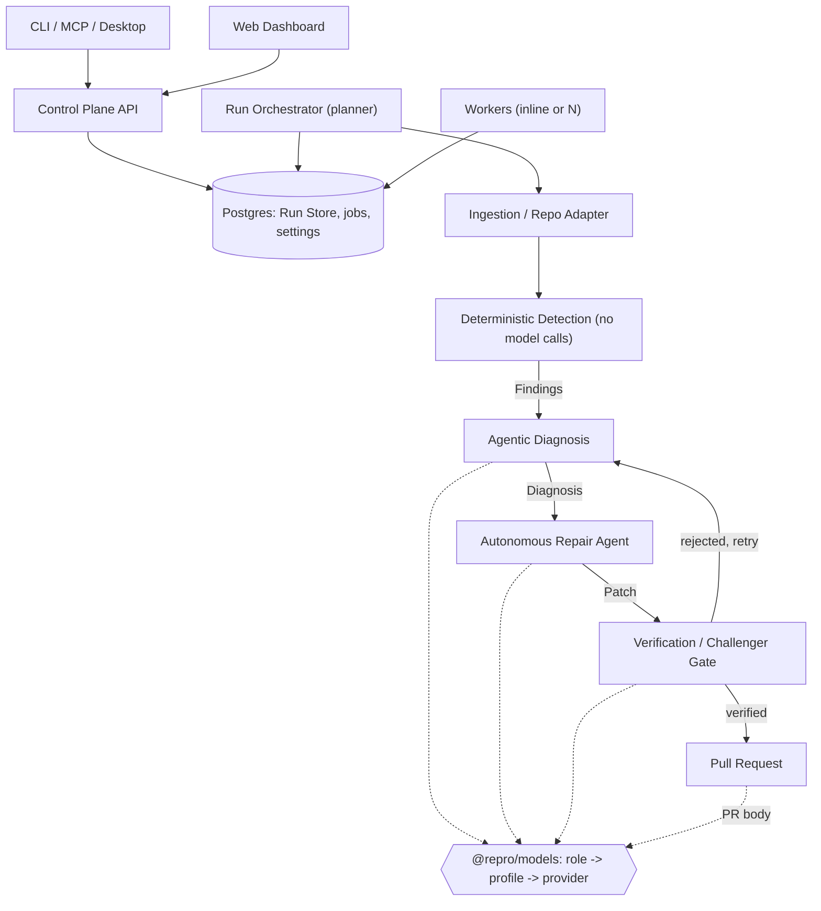

# Repro: Architecture, Contracts, and Team Guide

*Project context for the team and for any Claude session working on Repro. The ShellHacks build history is compressed into sections 8, 12, 13, and 14; architecture, contracts, safety rails, and commit conduct are kept. Section numbers are unchanged because code comments cite them ("section 4", "section 9", "section 10"). The migration in `docs/REARCHITECTURE.md` (Postgres, pluggable models, job queue) is written here as the target; until Lane 1 and Lane 3 land it, the code still runs on Mongo and Gemini-only. The original 36-hour build guide is kept in `docs/archive/CLAUDE-shellhacks.md`.*

## Contents

1. [What Repro is](#1-what-repro-is)
2. [Getting started](#2-getting-started)
3. [System architecture](#3-system-architecture)
4. [Core data contracts](#4-core-data-contracts)
5. [The pipeline in detail](#5-the-pipeline-in-detail)
6. [Working remotely and commit conduct](#6-working-remotely-and-commit-conduct)
7. [Status surface: CLI, API, web](#7-status-surface-cli-api-web)
8. [Positioning and the demo (ShellHacks record)](#8-positioning-and-the-demo-shellhacks-record)
9. [Safety rails](#9-safety-rails)
10. [Tech stack](#10-tech-stack)
11. [Team: three lanes](#11-team-three-lanes)
12. [Phases](#12-phases)
13. [Risks and mitigations](#13-risks-and-mitigations)
14. [Decisions](#14-decisions)

---

## 1. What Repro is

Point AI agents at a codebase, ground every finding in deterministic, reproducible evidence, diagnose root causes, and repair the code with proof the fix holds, not a plausible-looking diff. Built in 36 hours at ShellHacks, now being polished and re-architected.

Two standing decisions:

- **Grounded truth before reasoning.** A finding isn't a finding until it's reproduced against the running application or test suite. The deterministic Detect layer gives the agentic layers something true to reason about.
- **Proof-carrying repair.** A patch is done when the original finding no longer reproduces, the tests pass, and a second, adversarial agent failed to poke a hole in it.

The capability is general: evidence about whether code is reliable, trustworthy, or efficient, depending on the audience. Pointed at an AI tool's source, it answers the trust question (section 8).

**One rule for all new work:** features land as a new detector, a new piece of Diagnose's reasoning, a new dashboard view, or a change to what the system runs on, never by changing the five stages or their order.

## 2. Getting started

| Software | Why |
|---|---|
| Node.js 18+, Git 2.23+, `gh` | Build, branch, and open PRs |
| Claude Code (claude.ai Pro/Max) | The team's build tool; Routines and Dispatch need the subscription, not a Console key |
| Docker Desktop / Engine | The sandbox (section 9) and local Postgres (`docker compose up`) |
| Semgrep, gitleaks | Wrapped by the detectors; also run raw for the demo's opening beat |
| WSL2 (Windows) | Claude Code and the test suite are written for a POSIX checkout |
| A model provider | Either a `GEMINI_API_KEY` (one per developer, to spread quota), or a local runtime (Ollama, llama.cpp, vLLM, LM Studio) serving a model such as Qwen. Neither is a global install |

Steps: clone; install the software; `claude doctor`; authenticate; pair Dispatch (open Cowork on desktop and phone, turn on Dispatch, scan the QR code; the desktop must stay awake); read section 4; find your lane (section 11).

Storage: with `DATABASE_URL` unset Repro uses an embedded Postgres (PGlite), so nobody has to install a database. For shared work, one Postgres 16 instance (local Docker or a hosted one) is handed out by Lane 1 as a connection string; give yourself `REPRO_DB_SCHEMA=repro_<yourname>` so parallel work doesn't collide. Connection strings and API keys are env vars only, and never go in a Dispatch thread (whatever goes into it is a prompt).

## 3. System architecture

One control plane: a Run Orchestrator owns the idea of a "run" and moves it through five stages. The CLI, dashboard, detectors, and agents are clients or workers of that control plane. Nothing talks to another module directly; everything goes through the contracts in section 4. Detect never calls a model. A human is the only actor who can merge a repair PR.



- **CLI / Web / API**: one typed surface (Fastify + tRPC) over the Run Store.
- **Run Orchestrator and workers**: the orchestrator claims Runs and plans jobs; workers claim jobs with `SKIP LOCKED` (single-process mode runs an inline worker). Jobs are an execution detail inside a stage; `Run.stage` still means what is in flight.
- **Run Store**: Postgres tables for Runs, Findings, Diagnoses, Patches, the retained log, jobs, and settings; the single source of truth.
- **Ingestion**, **Executor** (sandboxed runner, section 4), **Detection Engine**, **Diagnosis**, **Repair**, **Verification / Challenger Gate**: as in section 5.
- **Model layer (`@repro/models`)**: the only place a provider SDK or HTTP client is imported. Roles (diagnose, challenger, repair, narrator) resolve to user-configurable profiles (provider, model, thinking level, limits). Providers: Gemini, OpenAI-compatible (vLLM, llama.cpp, LM Studio), and Ollama. Model IDs, retries, gates, budgets, and logging live here and nowhere else.

## 4. Core data contracts

Read literally. Where a field's meaning could go two ways, the semantics note says which is correct; treat a semantics note as a hard constraint. **This section is frozen: no rearchitecture task edits it or `@repro/contracts`.** Contracts are Zod schemas with inferred TypeScript types; `z.toJSONSchema()` derives the response schemas providers take. `Diagnosis.model` holds the exact model ID that produced it, never a friendly name.

### Pipeline data

```ts
// Emitted by a DetectorAdapter. No model involvement.
interface Finding {
  id: string;
  detectorId: string;        // "semgrep", "gitleaks", "custom-ast:null-deref"; matches DetectorAdapter.id
  ruleId: string;
  severity: "info" | "low" | "medium" | "high" | "critical";
  category: "vulnerability" | "inefficiency" | "correctness" | "style" | string;
  file: string;               // path relative to Workspace.path
  lineStart: number;
  lineEnd: number;
  message: string;
  evidence: string;          // exact snippet the claim is grounded in
  reproducible: boolean;
  reproductionCommand?: string;
  reproductionOutput?: string; // verbatim Executor output that flipped `reproducible` to true
  createdAt: string;
}
```

**Semantics.** `reproducible` starts `false` the moment a DetectorAdapter emits a Finding, always, no exceptions. It is only ever flipped to `true` by actually running `reproductionCommand` through the Executor and confirming the result demonstrates the issue, never because a detector's own internal confidence is high, and never inferred by Diagnose or Repair. If no `reproductionCommand` exists, `reproducible` stays `false` indefinitely and Diagnose treats it as unconfirmed input, not as grounds for a fix. `reproductionOutput` is the verbatim stdout/stderr excerpt from the ExecResult that flipped `reproducible` to `true`, written by the reproduction step and nothing else, never by a model, never edited afterward, and absent whenever `reproducible` is `false`.

```ts
// Emitted by the diagnosis agent. Must cite Finding IDs; nothing else is legal.
interface Diagnosis {
  id: string;
  findingIds: string[];
  rootCause: string;
  proposedStrategy: string;
  riskNotes: string;
  model: string;
  createdAt: string;
}
```

**Semantics.** `rootCause` and `proposedStrategy` may only describe what's true of the Findings in `findingIds`, their evidence, their file locations, their messages. The diagnosis agent may read surrounding code to write a coherent explanation, but nothing outside a cited Finding's locus is authoritative, and no new issues get introduced this way; a new issue is a new Finding, produced by Detect, not asserted here.

```ts
// Emitted by the repair agent, judged by the Verification / Challenger Gate.
interface Patch {
  id: string;
  diagnosisId: string;
  diff: string;
  filesChanged: string[];
  testsPassed: boolean;
  originalFindingReproduces: boolean;   // false == confirmed fixed
  reproductionOutputAfter?: string;     // the same reproductionCommand, run after the patch
  regressionFindings: Finding[];        // new findings the patch introduced; should be empty
  challengerVerdict: "confirmed" | "disputed";
  challengerNotes?: string;
  status: "proposed" | "verified" | "rejected" | "merged";
  prUrl?: string;
}
```

**Semantics.** `diff` is a standard unified diff, the literal output of `git diff`, applying cleanly with `git apply` against `Workspace.headCommit`. It is never a natural-language description of the change and never a full-file replacement. `status` only ever advances `proposed` → `verified` → `merged`, or terminates at `rejected`; only the Verification / Challenger Gate may set `verified`, only a human merging the PR may set `merged`. `reproductionOutputAfter` is the ExecResult excerpt from re-running the originating Finding's `reproductionCommand` against the patched workspace, captured by Repair's re-run and re-confirmed by Verify; it comes from the Executor, never from a model.

```ts
// Owned by the Run Orchestrator. One row per pipeline execution.
interface Run {
  id: string;
  trigger: "manual" | "schedule" | "webhook";
  target: { kind: "local" | "github"; ref: string };
  stage: "ingest" | "detect" | "diagnose" | "repair" | "verify" | "done";
  status: "queued" | "running" | "blocked" | "completed" | "failed";
  startedAt: string;
  logRef: string;
}
```

**Semantics.** `stage` reflects the pipeline stage currently in flight, not the last one completed; a Run showing `"repair"` means Repair is running now, not that Detect and Diagnose finished and nothing further has started.

### Execution and ingestion

Every lane that runs target-repo code (Detect's reproduction step, Repair, Verify) goes through these, never a raw shell call.

```ts
// Emitted by Ingest. Everything downstream reads from this; nothing touches the target repo's
// original location again once it exists.
interface Workspace {
  runId: string;
  path: string;               // sandbox-local path to the cloned/mounted code
  fileIndex: string[];        // every tracked file's path, relative to `path`
  languages: string[];        // detected languages present, e.g. ["typescript", "python"]
  headCommit: string;         // the exact commit the rest of the run is judged against
}
```

**Semantics.** `headCommit` is the single source of truth for "what code produced this Finding." If the target moves, a new commit lands upstream mid-run, this Run keeps working against its own `headCommit`; it does not silently pick up the new commit. `fileIndex` is a snapshot taken at ingest time; Detect does not re-walk the tree.

```ts
// The sandboxed command runner every stage that executes target-repo code depends on.
interface ExecRequest {
  workspacePath: string;      // from Workspace.path
  command: string;
  timeoutMs: number;
}

interface ExecResult {
  exitCode: number;
  stdout: string;
  stderr: string;
  timedOut: boolean;
  durationMs: number;
}
```

**Semantics.** Every invocation runs inside the ephemeral, network-restricted container from section 9, never on a teammate's machine or a shared host filesystem. A non-zero `exitCode` is not itself a failure signal for the Executor to interpret; the caller decides what its own command's exit codes mean (a linter's non-zero exit usually means "findings exist," not "the run broke"). One `ExecResult` per `ExecRequest`, no streaming, no partial results.

```ts
// The interface every wrapped scanner implements. The Detection Engine only ever calls this
// interface, never a specific tool's CLI directly.
interface DetectorAdapter {
  id: string;                                    // "semgrep", "gitleaks"; matches Finding.detectorId
  run(workspace: Workspace, exec: Executor): Promise<Finding[]>;
}
```

**Semantics.** An adapter translates a tool's native output into `Finding` objects; it does not filter by severity or otherwise editorialize, that judgment belongs to Diagnose. Every `Finding` an adapter returns starts with `reproducible: false`, per the rule above, regardless of how confident the underlying tool is.

## 5. The pipeline in detail

**Ingest.** A run against a local path or GitHub ref clones or mounts the code into a sandboxed workspace and builds a lightweight file and dependency index.

**Detect.** The engine runs every enabled adapter (Semgrep, gitleaks, privacy-patterns, osv, ruff, the target's own tests) and emits Findings. No model is called here: that is what makes everything downstream credible, and a model asked to "scan" would be exactly the model-authored Finding this stage exists to prevent. Immediately after, the reproduction step runs each Finding's `reproductionCommand` through the Executor; those that demonstrate the issue flip to `reproducible: true` and keep the output as `reproductionOutput`. Every Semgrep Finding's `reproductionCommand` is a re-run of that one rule against that one file.

**Diagnose.** Receives a batch of Findings plus the minimal code context each points to (whole enclosing file, plus source-to-sink files for taint), never raw source on its own, and produces Diagnoses. Rules that hold for **every** provider:
- The prompt contract forbids raising an issue not backed by a Finding ID.
- Findings with `reproducible: false` are labeled unconfirmed; a Diagnosis only moves on to Repair if every Finding it cites is `reproducible: true`.
- A deterministic Zod post-check requires every Diagnosis to cite at least one ID in the batch and rejects double citations; one retry, then drop and log. **This post-check is the guarantee.** Where a provider supports constrained decoding, the response schema is also built per call with `findingIds` enum-constrained to the batch, so a bad ID can't be emitted at all; providers without it rely on the post-check alone (`ModelCapabilities.constrainedDecoding`).
- When a Finding comes from `privacy-patterns` or gitleaks, `riskNotes` also states the plain-language consequence for a non-technical reader, citing only what the Finding's evidence shows.

**Repair.** Takes a Diagnosis, works through function calls (`read_file`, `replace_in_file`, `run_tests`, `rerun_detector`, `finish`; file tools are path-checked against `Workspace.path` and `fileIndex`; anything that executes goes through the Executor), runs the project's own tests plus the originating detector and reproduction command, and keeps that re-run's output as `reproductionOutputAfter`.
- **The model never writes the diff.** It edits through tools; on `finish` the harness runs `git diff` against `headCommit` and that output is `Patch.diff`. A provider's built-in code execution is never enabled: target code runs only in Repro's container.
- Hard caps: 15 tool calls per attempt, 2 attempts per Diagnosis (counting the verify-to-diagnose retry edge). Past that the Patch is `rejected` and the Run moves on.
- An evasion check reads the lines a patch adds and rejects code that tells a test run apart from real use, hides calls from the detector, or edits scanner suppressions, before the Challenger runs.
- Where a provider is stateless, the model layer emulates conversation chaining client-side; the agents' code doesn't change.

**Verify.** An adversarial Challenger, differently prompted and configured to use a **different model from Repair** by default, tries to disprove the patch: does the Finding still reproduce, did the patch introduce a new one, does it change behavior the tests don't cover. It sees the Findings, Diagnosis, diff, and deterministic results, never the repair agent's conversation. Its main tool is `run_counter_test`, run by the Executor against both `headCommit` and the patched workspace. Its final answer is a validated `{ verdict, notes }`; where a provider can't combine tools with structured output, the tool loop runs first and one schema-only call follows. **The gate is plain code:** `verified` only when `testsPassed`, `!originalFindingReproduces`, `regressionFindings` is empty, and `challengerVerdict === "confirmed"`. A dispute always blocks, and its notes feed the retry. Because the gate is deterministic, a weaker model (a small local one, say) lowers the *yield* of verified Patches, never their *trustworthiness*.

**Parallelism.** One Diagnosis's repair-and-verify is the unit. Repairs run concurrently, bounded by per-profile model concurrency, the run's request budget, and the Executor's capacity; Diagnoses whose Findings overlap in files run sequentially.

## 6. Working remotely and commit conduct

How the team builds Repro, not a product feature. **Dispatch** is the main channel: assign work from your phone to a Claude Code session on your desktop (which must stay awake) and reply at decision points. **Routines** are for well-defined recurring checks on Anthropic's infrastructure ("does lane 2 still merge cleanly hourly"): pre-approve permissions, give an explicit stop condition, default to a Sonnet-class model, and never give one the model API key (routines use a mocked model wrapper). **Remote Control** is for watching a live session step by step. Staying reachable means staying the decision-maker, not running unsupervised.

### Branch model

```
main   deployable, protected; receives only from dev
 └─ dev   integration: the three lanes meet here
     ├─ lane-1 (Adrian)   lane-2 (Brandon)   lane-3 (Alex)
     └─ lane-N/<topic>    short-lived, one agent per task
```

`main` and `dev` are protected on GitHub: no direct pushes, no force pushes, no deletion, changes only through a pull request. `main` additionally requires one approving review from someone other than the PR's author (enforced for admins too) and a code-owner review on anything under `packages/contracts`. Required status checks are added to both once the CI workflows exist (plan task C8).

### Commit conduct

This governs how Claude Code commits, pushes, and merges while building Repro itself. Section 9's stricter rule, a human always merges, still governs Repro's own product behavior against target and demo repos, unchanged. Two different repos, two different stakes, two different rules.

**Committing.** One logical change per commit; if a change can't be described in one sentence, it's two commits. Message format: `<lane>: <what changed>`, lowercase, imperative mood, no period, for example `lane-2: wrap gitleaks output as Finding[]`. No commit lands with failing tests or a broken build, a commit is a checkpoint, not a work-in-progress marker. Never commit directly to `main` or `dev`; every commit lands on that lane's own branch, or a short-lived sub-branch off it.

**Pushing.** Push after every commit that leaves the branch in a working state, don't batch a day's work into one push at the end. Push only to the lane's own branch or a sub-branch of it, never to `main` or `dev` directly, from any lane, ever. A push that would force-overwrite another session's unmerged work on the same branch stops and flags it in the Dispatch thread rather than resolving it unilaterally.

**Branches.** Each lane owns exactly one long-lived branch, named `lane-1` through `lane-3`, matching its commit message prefix. Default to committing directly on it; spin up a short-lived sub-branch, named `lane-N/<short-topic>`, only for something risky enough that it shouldn't land on shared lane history until it's working, and merge that back into the lane branch, never straight to `dev` or `main`, the moment it's done, then delete it. Sync a lane branch against `dev` by merging `dev` in, never by rebasing, rebasing means force-pushing history another session might already be working from, which the push rule above already rules out. If that merge doesn't resolve cleanly, stop and flag it in the Dispatch thread rather than resolving it unilaterally, same as a conflicting push.

**Cadence.** Commit and push at least once per hour of active work, and immediately after completing any unit of work that leaves things in a working state, whichever comes first. Long silent stretches followed by one large commit are exactly what makes remote supervision pointless, there's nothing to react to until it's already big. Follow this cadence without being asked each time; it's a standing rule, not a per-task instruction.

**Merging.** A lane may merge its own branch into `dev` on its own, autonomously, through a pull request, once the build passes, tests pass, and the PR touches nothing in `@repro/contracts`. Promoting `dev` to `main` is never autonomous: it is a pull request that one of the other engineers approves (through GitHub, with a heads-up in Dispatch), opened at the end of each wave or whenever `dev` is green and worth deploying, with the full suite green. Agents open the promotion PR at most; a human approves and merges it. Hotfixes branch off `main`, merge to `main` through a PR, and are merged into `dev` the same day. Any change that touches the contracts package, regardless of size and on either branch, stops short of merge and waits for confirmation from all three engineers through Dispatch, and needs a code-owner review; every other lane depends on that package, so this is the one place autonomy yields to a human on purpose.

**PR descriptions.** Title only, no body, unless the change touches the contracts package, in which case one line saying what changed and why. Never restate the diff in prose, the diff is the description. No what/why/how templates, no bullet-pointed feature lists, no generated changelog prose. If a title doesn't say enough on its own, that's a sign the commit should have been split, not that the PR needs more writing. The promotion PR follows the same rule. This is the rule for the team's own PRs on Repro; the repair PRs Repro opens on target repos are the opposite case, their body is the product (section 8).

## 7. Status surface: CLI, API, web

The API, Run Store, and `repro status` come first as the single source of truth; that alone gives a CLI and GitHub Checks or PR comments as working surfaces with no dedicated UI. The dashboard layers on the same API and is never where the differentiation lives. A PR carrying the full proof block (evidence, before and after reproduction output, test results, the Challenger's verdict) is the strongest product surface. The Trust Report (section 8) is the one dashboard view worth building regardless. A Settings → Models page (provider and model per role, discovered from the provider, with a Test button) is a configuration surface, not a chat surface.

**No chat surface, anywhere.** Not the CLI, not the dashboard, not an "ask about this finding" box. A person's inputs are a target ref, merge-or-reject on a PR, and configuration (dropdowns and toggles; a provider base URL is the one reviewed free-text exception, behind the API's allowlist). Any other free-text input gets flagged in review.

## 8. Positioning and the demo (ShellHacks record)

**The one claim we keep is Microsoft's** (a person accomplishing a real task, AI as part of the experience, no chatbot core), which Repro won at ShellHacks. It is why the no-chat rule (section 7) is a product invariant and why the proof fields on Finding and Patch exist. The other ShellHacks sponsor challenges (Assurant, MongoDB Atlas, Gemini) are no longer claimed anywhere, in docs or on the site. What they produced stays as ordinary product features: the `privacy-patterns` detector, plain-language consequences in `riskNotes` for privacy findings, the Trust Report (every claim links to its Finding), and the PR narrator, whose prose is labeled as model-written beside verbatim deterministic evidence. The pitch that survives: **the model proposes, the sandbox disposes.**

**The demo script**, the acceptance test for the product: (1) raw Semgrep and gitleaks on a seeded repo, hundreds of lines; (2) `repro scan` collapses that to what reproduction confirmed; (3) a Diagnosis citing several Finding IDs under one root cause, model ID shown; (4) Repair live, tool calls scrolling; (5) the Challenger disputes a fix, the retry passes the same counter-test; (6) the PR opens with the proof block and a person merges; (7) re-run the reproduction, the issue is gone. Don't open on the architecture diagram, don't demo Dispatch or Routines, and don't narrate; a teammate plays the person inheriting the repo. A recorded clean run, including the dispute, is the fallback.

## 9. Safety rails

- Every sandboxed execution (a target repo's build, its tests, the repair agent's shell commands) runs in an ephemeral, hardened container (no network, read-only root, resource limits, non-root, seccomp, digest-pinned image), never on a teammate's machine or a shared host filesystem.
- Every API mutation requires authentication and a role and is audited. Stored data is bounded by a retention window, and `Patch.diff` is redacted before it is stored.
- Agents never push to main and never merge their own PRs. A verified Patch is necessary, not sufficient; a human still clicks merge.
- The contracts package is a protected path: CODEOWNERS or branch protection requires human review on anything that touches it.
- Target-repo credentials are scoped to the minimum, used only at the PR-opening step, and never handed to a model as a raw secret.
- **A leaked secret never reaches a model,** local models included. gitleaks runs with `--redact`; a secret's value never lands in a Finding's `evidence`, in `reproductionOutput`, the Run Store, the dashboard, or any prompt.
- **The only free text a model reads is the target repo's contents and detector output, and both are untrusted.** Instructions found in code, comments, or commit messages are never followed; nothing a model produces runs anywhere except inside the Executor's container.
- **Model API keys and database URLs are runtime secrets:** env vars only, never in the repo, a prompt, a log, or the settings table. Configuration names the env var, never holds the value.
- **A provider's built-in code execution stays off everywhere.**
- **Know where prompts go.** A cloud provider may retain or train on submitted content on free tiers; check its terms before pointing Repro at private code. A local provider keeps code on the machine (`dataLeavesMachine=false`), which the dashboard shows. A user-supplied provider base URL is restricted to loopback and private addresses unless explicitly allowed, and API mutations require a token.
- Routines get pre-approved permissions and an explicit stop condition.
- Every run's full prompt and tool-call log is retained in the Run Store, and each Run snapshots the resolved model configuration it used, so a human can always answer "why did it do that" and "which model did it." Don't rely on a provider's server-side storage for this.

## 10. Tech stack

- **TypeScript** throughout; **Docker-first sandbox** for anything executing target code; **React + Vite** dashboard; **Fastify + tRPC** API sharing one typed client with the CLI.
- **Postgres 16 is the Run Store.** Managed Postgres with point-in-time recovery in production (`DATABASE_URL`), embedded PGlite when unset (desktop, tests). Drizzle ORM and forward-only migrations run as an explicit deploy step under an advisory lock; Zod contracts validate every read and write. Contracts don't change: `id` stays a plain string, and storage-only fields (`run_id`, an insertion `seq`) never leak past the store. Section 4's semantics are also enforced as database constraints and triggers as defense in depth. `run_logs` is partitioned monthly with a configurable retention window (default 90 days), and `Patch.diff` is redacted at rest.
- **Job queue:** pg-boss behind a `JobQueue` interface, with an in-process implementation for desktop and tests. Not hand-rolled: three engineers shouldn't own queue infrastructure.
- **Auth and audit:** authentication is required by default (Google sign-in for the dashboard, hashed scoped API keys for programmatic use); roles `viewer`, `operator`, `admin`; every mutation writes an audit row. The API binds to loopback by default, with a CORS allowlist and rate limits.
- **Observability:** structured logs (pino) carrying run, job, and request IDs; OpenTelemetry traces with spans for Run, job, stage, model call, and Executor call; Prometheus `/metrics`.
- **Sandbox baseline** (section 9): per-job ephemeral container, no network, read-only root, resource limits, seccomp default, digest-pinned image, orphan reaper.
- **Detectors: wrap, don't build.** Semgrep (JS/TS and Python) and gitleaks, plus privacy-patterns, osv, ruff, and the target's own tests. Wrapping the tools a person would run by hand keeps the demo's before and after honest.
- **Models: `@repro/models`, the only importer of any provider SDK.** Roles resolve to profiles: `{ provider, model, thinking, contextWindow, limits }`. Resolution, later wins: built-in defaults, `.repro/models.json`, dashboard settings, env vars, per-scan override. The resolved config is snapshotted per Run.

| Role | Built-in default | Thinking | Note |
|---|---|---|---|
| Diagnose | `gemini-3.1-pro-preview` | high | Root-cause reasoning benefits from a stronger model |
| Challenger | `gemini-3.1-pro-preview` | high | Deliberately not the same model as Repair |
| Repair | `gemini-3.8-flash` | high | Many calls per patch; speed and quota matter |
| PR narrator | `gemini-3.8-flash` | low | Latency over depth |

Env overrides: `REPRO_MODEL_DIAGNOSE`, `REPRO_MODEL_CHALLENGER`, `REPRO_MODEL_REPAIR`, `REPRO_MODEL_NARRATOR` (model IDs) and the matching `*_PROVIDER` variables. Presets: `gemini-default`, `local-qwen`, `hybrid` (local repair, cloud challenger). Local models are supported through OpenAI-compatible servers and Ollama. Which local model size runs is decided by a hardware check (`repro models doctor`: GPU and VRAM, RAM, runtime, and a smoke test), never hand-configured; capability probes and a bench (`repro models bench`) decide which roles a given model is recommended for, and the pipeline degrades explicitly (JSON tool mode, schema-only final call, smaller context budgets) rather than assuming Gemini's features. Re-check default model IDs against the provider's models page before relying on them.

- **Budget governance.** Two bills. *Building* Repro: Claude usage on the claude.ai subscription (Routines and Dispatch draw on it, not a Console key); default routines to Sonnet-class, reserve Opus-class for design-critical steps, cache the contracts context. *Running* Repro: cloud providers bill per call (use per-developer keys, and a billing-linked key on the demo host, since a 429 on stage is the likeliest way to lose a live demo); local providers cost time and hardware, so they default to one concurrent request. Per-profile request budgets and rate limits live in the model layer; unit tests mock the model layer; only integration checkpoints (`*.int.ts`) hit real providers, and routines never do.

## 11. Team: three lanes

Three engineers, one lane each. Lanes share only the frozen contracts and four interfaces: `RunStore` (Lane 3 builds), `ModelClient` (Lane 1), `Executor` (Lane 2), `JobQueue` (Lane 1, on Lane 3's Postgres). Full task plans are in `docs/REARCHITECTURE.md`.

**Lane 1 (`lane-1`), AI and backend: Adrian.** `@repro/models` (providers, profiles, capabilities, fallbacks, gates), the model-driven parts of `@repro/agents` (Diagnose, Repair, Challenger, narrator), the orchestrator and worker runtime, the API (authentication, roles, audit, rate limits, provider-URL guard), CLI, MCP, GitHub PR and Checks integration, and observability.

**Lane 2 (`lane-2`), deterministic engine: Brandon.** Ingest and per-job workspace materialization, detector adapters and rules, the reproduction step (the only thing allowed to flip `reproducible` and write `reproductionOutput`; gitleaks runs `--redact`), the hardened, concurrency-safe Executor and container reaper, `@repro/verify` (the gate, evasion check, and counter-tests: deterministic code that imports no model code), the model bench harness, and the green baseline.

**Lane 3 (`lane-3`), data and frontend: Alex.** The Postgres store, migrations, retention, backups, and diff redaction at rest; the dashboard (Settings → Models, auth and API-key pages, Run view, Trust Report), site, desktop packaging, run report and analytics, and the CI and release pipeline including the contract-diff guard. Holds the no-chat rule in review.

`@repro/contracts` is frozen and jointly owned; any change needs Dispatch confirmation from all three.

## 12. Phases

The 36-hour hour-by-hour timeline is retired. Work now runs in phases (P0 baseline, P1 foundations, P2 core, P3 integrate and cut over, P4 polish sprint, P5 remove old paths and pass the production readiness gates); see `docs/REARCHITECTURE.md` sections 6 to 9 for tasks, dependencies, the agent wave plan, and the exit criteria. Polish tasks always start with a failing test that reproduces the defect on `main`; a defect that no longer reproduces is closed, not "fixed". The ShellHacks build's lasting lessons: freeze contracts before code; write the demo script before any code; plant at least one bug whose obvious fix is wrong so the Challenger has something to catch; record a fallback video.

## 13. Risks and mitigations

| Risk | Mitigation |
|---|---|
| A hallucinated finding reaches a PR | Findings come only from Detect; Diagnose citations are post-checked (and decode-constrained where supported); the Challenger and gate block any unverified patch |
| A weak or local model games the checks | Evasion check, deterministic gate, and adversarial Challenger; a weak model lowers yield, not trust; bench measures it |
| A model produces a malformed diff | Can't: models edit through tools and `git diff` produces `Patch.diff` |
| Autonomous repair breaks a target repo | Everything sandboxed and PR-gated, never a direct push |
| Parallel repairs conflict at merge | File-locus scheduling and overlap notes on PRs |
| Provider rate limits during a demo | Billing-linked key, backoff and gates in the model layer, local fallback profile, recorded run |
| Lane merge conflicts | Lane-scoped branches, protected contracts, integrator-only shared files |
| Scope creep from a new challenge | Section 1's rule; anything touching the orchestrator's stage order gets questioned before merge |
| Judges read Repro as an AI assistant with extra steps | No prompt box (section 7); every model output sits beside the deterministic evidence that grounds it |

## 14. Decisions

Settled, with the reasoning in the sections above:

- **Ecosystems:** JavaScript/TypeScript and Python. **Detectors:** wrap Semgrep and gitleaks. **Repo access:** plain local clone. **Repair PRs:** land directly on the target repo, human-merged.
- **Contracts as Zod schemas; proof fields adopted** (`Finding.reproductionOutput`, `Patch.reproductionOutputAfter`, both optional and Executor-written).
- **Storage: Postgres** (Drizzle; PGlite for embedded and tests), replacing MongoDB.
- **Models: pluggable per role**, Gemini and local (OpenAI-compatible, Ollama) providers, resolved config snapshotted per Run. Claude Code remains the team's build tool, not part of the product.
- **Positioning:** only the Microsoft challenge is claimed (section 8). **Ask Repro dropped;** the PR narrator stays. No chat surface anywhere.
- **Production defaults:** managed Postgres with PITR, pg-boss, required auth with roles and audit, OpenTelemetry, hardened sandbox, model fallback chains that never send local-only code to a cloud without an explicit per-role opt-in.
- **Team:** three lanes (Adrian: AI and backend; Brandon: deterministic engine; Alex: data and frontend).
- **Diagnose's `findingIds` split** into confirmed and unconfirmed variants so no Diagnosis mixes them.
- **Deployment:** Google Cloud: a single Compute Engine VM with `docker compose` against Cloud SQL for PostgreSQL (Artifact Registry for the sandbox image, Secret Manager for secrets). Kubernetes (backlog task B10, a `KubernetesExecutor` with one Pod per job and a sandbox runtime) is deferred until the team grows or a listed trigger fires; multi-host workers ride with it.

Still open: the permanent Google credential plan for Gemini (today's user login expires after 7 days in Testing; verify service-account access first).
