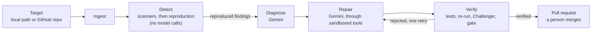

# Repro

**Proof, not promises.** Repro points AI agents at a codebase, grounds every finding in evidence you can re-run, and repairs the code with proof that the fix actually holds, not just a plausible-looking diff.

Repro was built in 36 hours for a hackathon.

## The problem

Scanners flag hundreds of lines, and most of them aren't real. AI coding tools will happily "fix" what they're told to, and return a diff that looks right. Neither one tells you whether the problem existed, or whether it's gone.

Repro holds itself to two rules:

- **Grounded truth before reasoning.** A finding isn't a finding until it has been reproduced: its reproduction command runs in a sandbox and the output shows the problem. A model can explain a finding and prioritize it, but it can never invent one.
- **Proof-carrying repair.** A patch is done only when the original finding no longer reproduces, the project's own tests still pass, and a second, adversarial agent has tried to break the fix and failed. Then a person reads the proof and decides whether to merge.

## How it works

Every scan is a **Run** that moves through five stages:



1. **Ingest** clones the target into a fresh workspace pinned to one commit.
2. **Detect** runs deterministic scanners, then re-runs each finding's own reproduction command in the sandbox. Only findings whose reproduction shows the problem are marked reproducible, with the output kept as evidence.
3. **Diagnose** has Gemini group findings by root cause and propose a fix. It can only cite the IDs of findings it was given; the response schema doesn't allow anything else.
4. **Repair** has Gemini edit files through a small set of tools (read, replace, run tests, re-run the detector). It never writes the diff itself: the harness takes `git diff` against the scanned commit.
5. **Verify** re-runs the tests and the reproduction, checks for new findings, and hands the patch to an adversarial **Challenger** that writes counter-tests to break it. A plain-code gate marks a patch verified only if every check passes.

A control plane sits behind all of this. The CLI and the web dashboard queue Runs through one API. An orchestrator takes each Run through the stages and records every result in the Run Store.

## What makes it different

- **Detection is deterministic.** Semgrep (the registry rules plus Repro's own privacy rules), gitleaks, osv-scanner, Ruff, and the project's own test suite. No model ever decides what counts as a finding.
- **Findings are reproduced, not just reported.** The noise a scanner produces collapses to what the sandbox actually confirmed. The reproduction output travels with the finding as its "before".
- **Gemini proposes, the sandbox disposes.** Every model output that matters is checked by something deterministic: a schema, `git diff`, the test suite, a detector re-run, a counter-test.
- **An adversarial pass before any PR.** The Challenger runs on a different model from Repair, never sees Repair's reasoning, and attacks with code, not opinions.
- **A person always merges.** Repro opens a pull request with the evidence pasted in verbatim. It never merges one.
- **No chat box.** You give Repro a target and read the proof. That's the whole interface.

## Tech stack

| Layer | What it uses |
|---|---|
| Language | TypeScript across an npm-workspaces monorepo |
| Reasoning | Gemini API through `@google/genai` (Pro for Diagnose and the Challenger, Flash for Repair and the PR narrator) |
| Run Store | MongoDB Atlas, with an in-memory store when no database is configured |
| Sandbox | Docker. Every command that touches target code runs in a throwaway container with no network |
| Control plane | Fastify and tRPC, with a CLI and a React and Vite dashboard on top |

## Getting started

### Prerequisites

- Node.js 20.12 or newer, and npm
- Docker (Docker Desktop, Docker Engine, or Colima), running
- Git
- Optional: a Gemini API key from [Google AI Studio](https://aistudio.google.com/), a MongoDB Atlas connection string, and a GitHub token for opening pull requests

### Install

```sh
git clone https://github.com/Bomoga/repro.git
cd repro
npm install
npm run sandbox:build   # builds the sandbox image every target command runs in
```

### Configure

Create a `.env` file at the repo root. It's gitignored.

```sh
GEMINI_API_KEY=...        # Diagnose, Repair, and the Challenger. Without it, runs stop after reproduction
MONGODB_URI=...           # optional: keeps runs across restarts. Unset means in-memory
REPRO_GITHUB_TOKEN=...    # optional: opens a pull request for each verified patch
```

### Run

```sh
npm run demo
```

This starts the control plane (API and orchestrator) on http://localhost:4000, the dashboard on http://localhost:5173, and the project site on http://localhost:5174. In the dashboard, press `/`, enter a target such as `owner/repo`, a GitHub URL, or an absolute local path, and follow the Run through its stages.

The same Runs are available from the terminal:

```sh
npm run cli -- scan owner/repo --watch   # queue a scan and follow it
npm run cli -- status                    # recent runs
npm run cli -- report <runId>            # what a run found, reproduced, and fixed
```

Without a Gemini key, Repro still ingests, detects, and reproduces for real; it skips Diagnose, Repair, and Verify.

### Develop

```sh
npm run build                     # type-check everything
npm test                          # the full suite (sandbox tests need Docker and the built image)
REPRO_NETWORK_TESTS=1 npm test    # also the tests that reach GitHub and the package registries
```

## Repository layout

| Path | What's there |
|---|---|
| `packages/contracts` | The shared data contracts (Finding, Diagnosis, Patch, Run, Workspace) as Zod schemas |
| `packages/ingest` | Clones a target into a workspace pinned to one commit |
| `packages/executor` | The Docker sandbox, and the dependency install that reaches only the npm and PyPI registries |
| `packages/detect` | The detector adapters and the reproduction step |
| `packages/agents` | The Gemini wrapper, Diagnose, Repair, the Challenger, and the verification gate |
| `packages/orchestrator` | Takes each Run through the stages, and opens pull requests for verified patches |
| `packages/store`, `packages/api` | The Run Store and the Control Plane API |
| `packages/cli`, `packages/web` | The terminal client and the dashboard |
| `packages/github` | Pull request narration and GitHub integration |
| `sandbox/` | The sandbox image: scanners, rule packs, and the reproduction helpers |

## Safety

- Target code runs only inside the sandbox: no network, a read-only root filesystem, and no added privileges. Installing a target's dependencies is the one step with network access, and it reaches only the npm and PyPI registries, through a proxy.
- gitleaks always runs with `--redact`, and secrets are redacted from everything sent to a model.
- Model API keys are read from the environment only.
- No model's built-in code execution is enabled anywhere.
- Target code, comments, and scanner output are treated as untrusted data, never as instructions.

## More documentation

- [`DEMO.md`](DEMO.md): running the demo, and where verified patches go
- [`ENVIRONMENT.md`](ENVIRONMENT.md): every environment variable, and setting up MongoDB Atlas
- [`CLAUDE.md`](CLAUDE.md): the team's full guide to the architecture, the data contracts, and how the project is built
- Package guides: [`packages/detect`](packages/detect/README.md), [`packages/orchestrator`](packages/orchestrator/README.md), [`packages/store`](packages/store/README.md)
