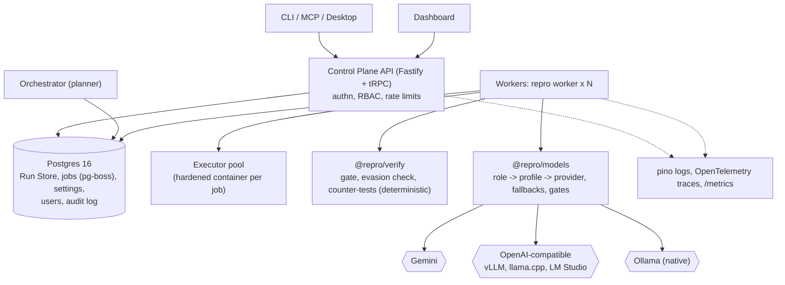

# Repro rearchitecture: Postgres, pluggable models, parallel repair, production hardening

Status: proposed, revision 2 (three lanes, production defaults, Microsoft-only positioning). Section numbers ("section 4") refer to the root `CLAUDE.md`, whose stable numbering is kept.

## 0. Summary

Four changes, one rule.

1. **Storage: MongoDB (Mongoose) to Postgres.** One `RunStore` implementation instead of three layers (`@repro/store` Mongoose, the `MongoRunStore` adapter in `@repro/api`, `MemoryRunStore`).
2. **Models: Gemini-only to per-role, user-configurable providers**, including local models (Qwen through Ollama, llama.cpp, vLLM, LM Studio), with fallback chains.
3. **Parallelism: in-process repair concurrency to a durable job queue** on Postgres, drained by workers under per-provider concurrency and budget gates.
4. **Production hardening:** real authentication and authorization, observability, sandbox hardening, retention and backups, CI and release.

**The rule: contracts do not change.** Nothing below edits `@repro/contracts`, the five stage names, or their order. New schemas (model config, jobs, settings, users) live in `@repro/models` and `@repro/store` as storage or config detail, the way `runId` already does. A task that finds it needs a contract change stops and flags it in Dispatch.

**Positioning.** The only sponsor claim we keep is the Microsoft challenge (a person accomplishing a real task, no chat surface), which we won. Its no-chat rule stays as a product invariant because it is what the win rests on. The Assurant, MongoDB Atlas, and Gemini prize claims are dropped; the features they produced (privacy-patterns detector, Trust Report, PR narrator) stay as ordinary product features, no longer challenge-shaped.

## 1. What the code already gives us

Verified against `main` on 2026-09-30.

| Fact | Consequence |
|---|---|
| `packages/agents/src/gemini.ts` is the only SDK importer and already owns routing, retry, budget, log, and auth modes | Extract to `@repro/models` with no behavior change; add providers beside it |
| Agents talk to `GeminiClient.interact()` and chain with `previousInteractionId` | A stateless provider emulates chaining with a per-Run transcript, so **agent code barely changes** |
| `RequestBudget` infers "Pro tier" from the diagnose/challenger model IDs | Generalize to a per-profile quota, or a local model inherits Gemini's rules |
| `REPRO_REPAIR_CONCURRENCY` plus `workspace-copy.ts` already repair N diagnoses at once, in one process | The queue generalizes this; the byte-for-byte `git apply` property must survive |
| `Orchestrator.shutdown()` marks the in-flight Run `failed` because it "can't be resumed" | With durable jobs it can be resumed |
| `RunStore` lives in `api/src/store/types.ts`; the orchestrator imports it from `@repro/api` | Inverted dependency; fix first |
| Detect runs adapter groups concurrently; Reproduce has `concurrency` (default 3) | No new Detect parallelism needed, only an Executor that tolerates it |
| `gate.ts`, `evasion.ts`, `counter-tests.ts` (deterministic) sit in `@repro/agents` beside model-driven code | Split into `@repro/verify` so "the sandbox disposes" is a package boundary, not a convention |

## 2. Reproduced polish backlog

Every item from earlier reviews was re-checked against `main`. Result, so nobody re-fixes what is already fixed:

| Item | Status | Evidence |
|---|---|---|
| API test runner finds no tests | **Fixed** | `npx vitest run packages/api`: 8 files, 106 tests pass |
| PR body: unlabeled Gemini prose, no verbatim evidence | **Fixed** | `pullRequestBody` labels model prose and pastes evidence, reproduction output, and `reproductionOutputAfter` verbatim |
| Dashboard scan box suggests "main", always sends a GitHub ref | **Fixed** (residual: refuses Windows-style local paths like `C:\…`; only `/`-prefixed local paths pass) | `ScanBar.tsx` accepts local paths and GitHub refs |
| CORS accepts any origin; API listens on `0.0.0.0` | **Still present** | `app.ts:24` `cors, { origin: true }`; `main.ts:29` default host `0.0.0.0` |
| No authentication on mutations | **Still present** | every tRPC procedure is `publicProcedure`, including `patches.decide`, `settings.setPullRequestMode` |
| `patches.decide` marks `merged` without a real PR merge | **Still present** | router calls `store.setPatchDecision` only; the poller reconciles PR-backed patches later, but the dashboard button and CLI/MCP paths still write `merged` directly |
| `Patch.diff` stored and served verbatim, secrets in removal diffs | **Still present** | `store/README.md` documents it as an unresolved rule conflict; no redaction in store or API |
| Credential masking and `GOOGLE_GENAI_DEBUG` refusal only in Google sign-in mode | **Still present** | `refuseSignInConflicts` and `signInFailure` are google-mode only; `classify` in api-key mode doesn't mask |
| Agent candidates: hold-out counter-tests, insecure-fallback rule, several tool calls per turn, reject vacuous counter-tests | **Open (features, not defects)** | no matches in `packages/agents/src` |
| Demo-target detection gaps (generic `db.query` SQLi, `sk-demo-…` key) | **Not reproduced** (needs the Docker sandbox and Semgrep) | task B5 starts by reproducing it |
| Checks API needs a GitHub App token; PR opener and webhook vs real GitHub; Google sign-in vs real API | **Not reproducible offline** | need a throwaway GitHub repo and a real Google project; tasks A9 and A10 start there |
| Five Windows-only test failures | **Reproduced 2026-09-29** (see memory note) | environment artifacts in tests, fixed in B1 |
| `@repro/api` still lists `mongoose` and `mongodb-memory-server` in devDependencies | **New finding** | removed in C6 |

Rule for every polish task: **first commit is a failing test that demonstrates the defect on `main`**; a task whose defect no longer reproduces is closed with a note, not "fixed".

## 3. Target architecture



Stages and order are unchanged; jobs are an execution detail inside a stage, and `Run.stage` still means "what is in flight now". **Job kinds:** `ingest`, `detect` (detect plus reproduce), `diagnose`, `repair` (one per eligible Diagnosis; repair and verify stay one job because the retry edge is internal), `pr` (one per verified Patch).

**Single-process mode stays** for desktop and local use: an in-process `JobQueue` implementation, and embedded Postgres (PGlite) when `DATABASE_URL` is unset. Shared and production deployments use real Postgres and pg-boss.

## 4. Decisions taken (production defaults)

Picked for a production tool maintained by three engineers: prefer mature libraries over owning infrastructure, and make the secure option the default.

| Area | Decision | Why |
|---|---|---|
| Database | **Postgres 16, managed** (any provider), PITR backups on, `DATABASE_URL`; PGlite only for desktop and tests | Real durability and ops tooling; one SQL dialect everywhere |
| Data access | **Drizzle ORM + drizzle-kit migrations**; Zod contracts validate every read and write | Typed SQL close to the metal; contracts stay the source of truth |
| Migrations in deploy | Run as an explicit step under `pg_advisory_lock`, forward-only, each reviewed by Alex; app refuses to start on a schema version mismatch | No migration races between workers |
| Job queue | **pg-boss** behind a `JobQueue` interface (retries, expiry, dead-letter, singleton keys, heartbeat), plus an in-process implementation for desktop and tests | Three engineers shouldn't own a queue. `pr` is enqueued by the planner when its `repair` completes, so no dependency graph is needed |
| Pooling | Transaction-pooler safe (no session state); the queue and `LISTEN` use a direct connection | Works behind PgBouncer-style poolers |
| Authentication | **Required by default** except loopback in desktop mode. Dashboard: Google sign-in (OIDC). Programmatic: hashed, scoped API keys | Replaces "no auth is fine for a hackathon" |
| Authorization | Three roles: `viewer` (read), `operator` (scan, decide patches), `admin` (settings, keys, model config). Every mutation writes an `audit_log` row | A tool that merges code needs an audit trail |
| API hardening | Bind `127.0.0.1` by default, CORS allowlist from env, per-key rate limits, request size limits, SSRF guard on provider `baseUrl` | Closes the reproduced CORS/bind/auth findings |
| Observability | **pino** structured logs with run and job IDs; **OpenTelemetry** traces (Run, job, model call spans) with an OTLP exporter; Prometheus `/metrics` (queue depth, job latency, model errors, budget use) | "Why did it do that" is already a requirement (section 9); traces make it queryable |
| Sandbox | Ephemeral container per job: no network, read-only root, tmpfs scratch, cpu/memory/pids limits, seccomp default, image pinned by digest, rootless or gVisor runtime when available, orphan reaper | Section 9 upgraded from "network-restricted" to a hardened baseline |
| Retention | `run_logs` partitioned monthly, default retention 90 days (configurable); `Patch.diff` redacted at the store boundary | Section 9's "a secret never reaches the Run Store" finally holds |
| Model resilience | Per-role **fallback chain** (e.g. local, then cloud), circuit breaker after repeated failures, per-profile rate limit and budget | A quota stop on stage was the top demo risk; production needs the general fix |
| Local model flavors | `openai-compatible` and a native `ollama` adapter | Ollama's OpenAI-compat endpoint may not honor per-request context size; verify against the version we target |
| Statefulness across providers | Client-side transcript emulation for stateless providers | Keeps `repair.ts` and `challenger.ts` unchanged |
| Deployment | **Single Linux VM** running one `docker compose` reference stack (API, workers, Ollama optional) against managed Postgres; multi-host workers and Kubernetes **deferred to backlog task B10** (`Workspace.path` is sandbox-local by contract; the sandbox needs a Docker daemon) | Honest scope for three people |
| CI/CD | GitHub Actions on Linux with Docker; required checks: typecheck, unit, conformance (Postgres service), contract-diff guard, sandbox image build, dependency audit; signed desktop releases | A green baseline everyone can see |
| Secrets | Env or secret manager only; config names the env var; settings and audit tables have no secret columns, enforced by a test | Section 9 |

## 5. Lanes (three engineers)

Assumption to confirm: **DVBD** is read as the deterministic engine, meaning ingest, detect, verify (the gate, evasion check, counter-tests), and the sandbox. If DVBD means something narrower, only Brandon's boundary with Adrian's shifts.

| Lane | Branch | Engineer | Owns |
|---|---|---|---|
| **Lane 1: AI and backend** | `lane-1` | Adrian | `@repro/models`, `@repro/agents` (model-driven Diagnose, Repair, Challenger, narrator), `@repro/orchestrator`, `@repro/api`, `@repro/cli`, `@repro/mcp`, `@repro/github`, observability |
| **Lane 2: Deterministic engine** | `lane-2` | Brandon | `@repro/ingest`, `@repro/detect`, `@repro/executor`, new `@repro/verify`, `sandbox/`, the bench harness |
| **Lane 3: Data and frontend** | `lane-3` | Alex | `@repro/store` (Postgres), migrations, `@repro/web`, `@repro/site`, `@repro/desktop`, run report and analytics, CI and release pipeline |

Etiquette is unchanged: one branch per lane, `lane-N:` commit prefix, sub-branches `lane-N/<topic>`, merge `main` in never rebase, hourly cadence, autonomous merge only when the change touches nothing in `@repro/contracts`. `@repro/contracts` is frozen and owned jointly; any change there needs Dispatch confirmation from all three. Old `lane-4*` and `lane-5*` remote branches are retired: Adrian confirms each is merged, then deletes it (a human action; nothing is deleted by an agent).

**Cross-lane interfaces (the only things lanes share):** `RunStore` (Alex builds, everyone consumes), `ModelClient` (Adrian builds, `@repro/verify` and bench consume), `Executor` (Brandon builds, everyone consumes), `JobQueue` (Adrian builds on Alex's Postgres), and the frozen contracts.

## 6. Phases and dependencies

Sizes: S under a day of agent time, M a day or two, L several days. Relative, not calendar.

| Phase | Goal | Tasks |
|---|---|---|
| **P0 Baseline** | Everyone starts green | B1 (Linux CI, Windows test fixes), C1 (RunStore seam), A1 (models extraction). All three are independent |
| **P1 Foundations** | Build behind flags | A2, A3, C2, C3, B2, B3, A7 (auth), C7 (tables for auth and audit) |
| **P2 Core** | The new paths | A4, A5, A6, C4, C5, B4 (after A1), B6, A8 |
| **P3 Integrate** | Flip defaults | C6 (cutover), A9, A10, B7, B8, C8, C9, C10 |
| **P4 Polish sprint** | Fan-out backlog | Section 8 |
| **P5 Remove and ship** | Delete old paths, production gates | Section 9 |

Hard edges: **A1 before B4** (both restructure `packages/agents`). C1 before A6 and everything that imports the store. C4 before the desktop path. C2/C3 before C6. A5 before A8. B3 before A8. A7 and C7 agree on auth table shapes before either builds (30-minute contract review, then independent).

## 7. Task plans

Each task: goal, steps, tests, done-when. IDs are `A` (Lane 1), `B` (Lane 2), `C` (Lane 3).

### Lane 1: AI and backend (Adrian)

**A1 Extract `@repro/models` (M).** Pure refactor; merge first.
1. Move `gemini.ts` and its tests unchanged to `packages/models/src/providers/gemini.ts`; `index.ts` re-exports.
2. Rename `GeminiClient→ModelClient`, `GeminiRole→ModelRole`, keeping type aliases so agents, orchestrator, and github keep compiling; `@repro/agents/src/gemini.ts` becomes a re-export shim, deleted in P5.
3. Enforce "only `@repro/models` imports a provider SDK" with a grep-based test.
Done when: existing agent tests pass with import-only edits.

**A2 Provider interface, profiles, config, fallbacks (M).**
1. `ModelProvider { kind; capabilities(model); createClient(profile, deps) }` and a registry. `ModelCapabilities`: `nativeTools`, `structuredOutput: schema|json|none`, `structuredWithTools`, `constrainedDecoding`, `thinking: levels|toggle|none`, `statefulChaining`, `contextWindow`, `maxOutputTokens`, `maxConcurrency`, `dataLeavesMachine`.
2. Config (Zod, in `@repro/models`, never in contracts):
   ```jsonc
   { "providers": { "cloud": {"kind":"gemini","auth":"api-key"},
                    "local": {"kind":"ollama","baseUrl":"http://localhost:11434"} },
     "roles": { "diagnose":  {"provider":"cloud","model":"gemini-3.1-pro-preview","thinking":"high"},
                "repair":    {"provider":"local","model":"qwen3-coder:30b","contextWindow":32768,
                              "fallback":[{"provider":"cloud","model":"gemini-3.8-flash"}]},
                "challenger":{"provider":"cloud","model":"gemini-3.1-pro-preview"},
                "narrator":  {"provider":"local","model":"qwen3:8b","thinking":"low"} } }
   ```
3. Resolution, later wins: defaults, `.repro/models.json`, DB `settings` (dashboard), env (`REPRO_MODEL_<ROLE>` and `_PROVIDER` still honored), per-scan override. The resolved config is snapshotted into `run_configs` at claim time.
4. Fallback chain and circuit breaker: a role's client tries the primary, then each fallback on non-retryable provider failure or an open breaker; every switch is logged with the reason. A fallback that sends code off the machine when the primary was local requires an explicit `allowEgress: true` on that role (default false), so a local-only user is never silently sent to a cloud.
5. Presets: `gemini-default` (today's table), `local-qwen`, `hybrid`.
6. Warnings, not errors: challenger and repair on the same model (independence); `contextWindow` too small; repair role without tool support.
Tests: env-only legacy setups resolve exactly to today's `modelFor` outputs; a fallback-with-egress test.

**A3 OpenAI-compatible and Ollama providers (L).**
1. `openai-compatible`: `POST {baseUrl}/chat/completions` with `tools` and `response_format` json_schema; usage mapping; timeouts sized for local generation.
2. `ollama`: native `/api/chat` with `options.num_ctx`, `format` schema, `think`, `stream:false`.
3. **Transcript emulation:** the client mints `interactionId`s and keeps `id → messages[]` per client instance (one per Run already). Function results append as `tool` messages. An unknown id is a non-retryable error.
4. Reasoning: strip `<think>…</think>` and `reasoning_content` from `outputText`, write it to the run log, never feed it back.
5. Thinking mapping: level to the provider's toggle or budget; missing levels collapse to on/off.
6. Errors: connection refused retryable once, then "nothing is listening at {baseUrl}; is Ollama running?"; model-not-found non-retryable and names `ollama pull`; 429/5xx as today.
7. Capability probe at first use (a tool-call round trip and a schema round trip), cached and logged, so declared capabilities are verified.
8. Redaction still applies to every provider: secrets never reach any model (section 9).
Tests: an in-process fake OpenAI-compatible server replaying malformed tool JSON, `<think>` blocks, and a dropped connection.

**A4 Capability-driven degradation (M).**
1. Tool calls unsupported or flaky: `json-fallback` mode, one JSON action per turn parsed with Zod, retried once; the 15-call cap is unchanged.
2. `structuredWithTools=false`: the Challenger's "tool loop, then schema-only call" becomes the default for that profile.
3. `constrainedDecoding=false`: Diagnose loses decode-time enum on `findingIds`; the Zod post-check is the guarantee, tested per provider.
4. `file-context.ts` caps (60,000 and 30,000 chars) become fractions of `contextWindow`; Diagnose batch size shrinks with it.
5. `compact` prompt variants for small models; audit prompts for Gemini-specific wording.
Invariant test: a scripted "bad local model" emitting gamed patches never yields a `verified` Patch. **A weaker model changes yield, never trust.**

**A5 Gates and budgets (M).**
1. `ModelGate` per profile: concurrency semaphore, requests-per-minute limiter, request budget.
2. Replace `RequestBudget`'s "Pro" inference with `profile.quota.scarce`; `REPRO_PRO_REQUEST_BUDGET` stays as an alias for diagnose and challenger; `PRO_REQUESTS_PER_DIAGNOSIS` is computed from the challenger profile.
3. Local profiles default to `maxConcurrency: 1`.
Tests: N concurrent callers never exceed `maxConcurrency`; budget exhaustion throws the same non-retryable error as today.

**A6 Orchestrator becomes a planner (L).**
1. Define `JobQueue` (enqueue, claim, heartbeat, complete, fail, cancelRun) with two implementations: in-process, and pg-boss (Alex provides the schema and connection in C5).
2. Split `processRun` into per-stage planners that enqueue jobs, plus a **rollup** that derives `Run.stage` and `status` from job states, generalizing `settleStage` ("repair while any repair is in flight; verify only when all are with the Challenger").
3. `repair` jobs: one per repair-eligible Diagnosis (`isRepairEligible` unchanged); `pr` enqueued when its `repair` completes, in diagnosis order.
4. Keep `Stages` injection so `pipeline.test.ts` and `parallel-repair.test.ts` pass against the in-process queue with no logic edits.

**A7 Authentication and authorization (L).** Fixes the reproduced CORS, bind, and no-auth findings.
1. Bind `127.0.0.1` by default; CORS allowlist from `REPRO_CORS_ORIGINS`; `@fastify/rate-limit`; body size limits.
2. Replace `publicProcedure` with `viewerProcedure`, `operatorProcedure`, `adminProcedure` (tRPC middleware reading the session or API key). Reads require `viewer` except on loopback in desktop mode.
3. API keys: 32-byte random, shown once, stored as a SHA-256 hash with role, name, `last_used_at`, optional expiry (table from C5). `repro auth login` and env `REPRO_API_KEY` for the CLI and MCP.
4. Dashboard sessions: extend the existing Google sign-in into a real session (signed, httpOnly, sameSite=strict cookie); first user becomes `admin`, later users default to `viewer`, promoted by an admin.
5. Audit log row for every mutation: who, what, target ID, request ID; never request bodies that could hold secrets.
6. SSRF guard for provider `baseUrl`: loopback and RFC1918 only unless `REPRO_ALLOW_REMOTE_MODEL_URLS=1`; resolve DNS and re-check the resolved IP at request time.
Tests: mutation without credentials is 401, `viewer` cannot decide a patch, `http://169.254.169.254` is refused, key hashes never appear in logs or responses.

**A8 Worker runtime and scheduling under gates (L).** Depends on A5, A6, B3.
1. `repro worker --concurrency N --kinds …`; heartbeat; SIGTERM requeues the running job without consuming an attempt; a restarted control plane requeues stale-heartbeat jobs, and `shutdown()` stops marking Runs failed.
2. Idempotency: `savePatch` replaces by id; the PR opener checks for an existing `prUrl`; repair attempts restart from `git reset --hard headCommit`.
3. A repair job starts only after acquiring a `ModelGate` slot for its repair and challenger profiles, a budget reservation, and a private workspace (B3).
4. Budgets live in Postgres (`run_budgets`, `UPDATE … WHERE used < limit RETURNING`) so concurrent workers can't overspend. Exhaustion cancels queued repairs for the Run, lets running ones finish, and opens PRs for what verified.
5. Consume B7's overlap groups: diagnoses whose loci overlap run sequentially, others in parallel.

**A9 Patch decisions and the PR path (M).** Starts by reproducing against a **real throwaway GitHub repo** (the offline fakes hide the gaps).
1. Reproduce the reported `merged`-without-merge behavior; then define semantics: for PR-backed patches, `patches.decide("merge")` calls GitHub's merge API (operator role, audited) and sets `merged` only on success, else records the failure; `reject` closes the PR. For local-only patches (no `prUrl`), decide applies the branch locally as today and says so in the response.
2. Real-GitHub smoke: PR open, webhook signature, poll reconciliation, Checks API with a GitHub App token.
3. Add the Windows-path residual in the dashboard scan box to the tracker for Alex (C10).

**A10 Models API, CLI, and MCP surface (M).** Depends on A2, A7.
1. tRPC: `settings.models.get/set` (admin), `models.discover(providerId)` (server-side `/api/tags` or `/v1/models`), `models.test(role)` (a one-request health check generalizing `gemini:check`).
2. CLI: `repro models list | set <role> <provider>:<model> | test | bench`; MCP tools mirror read and test operations.

**A11 Observability (M).**
1. pino everywhere, with `runId`, `jobId`, `requestId` bound; redact known secret shapes at the logger.
2. OpenTelemetry: spans for Run, job, stage, model call (attributes: role, provider, model, tokens, retries, fallback used), Executor call; OTLP exporter configured by env, off by default.
3. `/metrics` (Prometheus): queue depth and age, job duration by kind, model errors and breaker state, budget used, Executor concurrency.
4. Alerts documented (queue age, breaker open, budget exhaustion), no vendor lock-in.

**A12 Agent polish (fan-out).** Model-side items only; deterministic rules go to Lane 2.
- Mask credentials and refuse `GOOGLE_GENAI_DEBUG` in api-key mode too (reproduced).
- Several tool calls per turn (repair loop), gated by `capabilities.parallelTools`.
- Prompt updates that teach the Challenger to write hold-out counter-tests (pairs with B6) and the insecure-fallback rule (pairs with B6).

### Lane 2: Deterministic engine (Brandon)

**B1 Green baseline (S).** The five Windows failures are test defects, not code defects:
1. `.gitattributes`: LF for `packages/*/test/fixtures/**` (autocrlf failure).
2. `install.test.ts`: compare with `path.posix` where the code emits POSIX paths; skip the venv symlink case on `win32`.
3. `tests-adapter.test.ts` (executable bit) and `repo-adapter.test.ts` (`/etc/hosts`): `it.skipIf(process.platform === "win32")`.
4. Linux CI job (Docker available, `npm run sandbox:build`) so "green" is objective. Alex wires the workflow; Brandon owns the test fixes and the sandbox build step.
Done when: 0 unexpected Windows failures and Linux CI required on PRs.

**B2 Executor for concurrency and hardening (M).**
1. `DockerExecutor`: `maxConcurrent` semaphore; container names `repro-<runId>-<jobId>-<n>`; label `repro.run=<runId>`; timeouts kill the container.
2. Hardening baseline: `--network none` (asserted by a test), read-only root, tmpfs scratch, cpu/memory/pids limits, default seccomp, no new privileges, non-root user, image pinned by digest; a `runtime` option for `runsc` (gVisor) or rootless.
3. Reaper: on worker start, remove containers labeled with dead runs.
Tests: 8 parallel `exec`s with `maxConcurrent=3`; a killed worker leaves no orphan after reaping; a container cannot reach the network or write outside scratch.

**B3 Workspace materialization for jobs (M).**
1. Move `orchestrator/src/workspace-copy.ts` into `@repro/ingest` as `materialize(workspace, jobId)` and `release(copy)`; Adrian switches the orchestrator over in A8.
2. Preserve PROGRESS.md's property: no user or system git config, no autocrlf, so a patch made in a copy applies byte for byte to `headCommit`.
3. Ingest keeps a bare mirror per Run so materializing is a cheap local clone.
Tests: the existing `workspace-copy.test.ts`, moved, plus "diff from a copy applies to the original" on a CRLF fixture.

**B4 Extract `@repro/verify` (M).** After A1.
1. Move `gate.ts`, `evasion.ts`, `counter-tests.ts` and their tests into `packages/verify`; `@repro/agents` imports them.
2. **Boundary test:** `@repro/verify` imports no model, provider, or `@repro/agents` code (grep-based, in CI). The gate stays "plain code" by construction.
3. Public surface: `evaluateGate`, `checkEvasion`, `runCounterTest`, and the counter-test result types.

**B5 Detector polish (M, sub-tasks parallelizable).**
1. **Reproduce the demo-target gaps first** (generic `db.query` SQL injection, `sk-demo-…` key) by running the sandbox scan; commit the failing test, then add Semgrep rules and a custom key pattern with `semgrep --test` fixtures (`npm run test:rules`).
2. Deterministic Finding order and stable IDs for one `headCommit`, needed for idempotent jobs and regression comparison.
3. Reproduction-protocol tests for undecided outcomes (fail closed), kept green.

**B6 Verify polish (M).** All deterministic, all in `@repro/verify`.
1. Reject counter-tests that prove nothing (pass on both `headCommit` and patched, or assert nothing): a static and dynamic check; a "vacuous" outcome is not evidence.
2. Hold-out counter-tests: counter-tests written on attempt 1 that Repair never saw on attempt 2 are re-run against attempt 2 so a fix can't be tuned to the visible test. (Prompt work is A12.)
3. Insecure-fallback rule in `evasion.ts`: a patch that replaces a removed hardcoded secret with a hardcoded default when the environment variable is missing is rejected, per language.
Each rule ships with positive and negative fixtures, extending `test/fixtures/evasion/`; existing verified fixtures must remain unflagged.

**B7 File-locus overlap analysis (S).** Pure functions in `@repro/verify`: `groupByLocus(diagnoses, findings)` (connected components over overlapping file and line ranges) and `patchOverlap(patchA, patchB)` (hunk overlap on the same file). Adrian consumes them in A8 and in PR bodies ("may conflict with PR X").

**B8 Bench harness (M).** Engine behind `repro models bench`.
- Diagnose suite on `test/fixtures/findings.ts`: citation validity, grouping, retry rate.
- Repair suite on `demo-target`: verified rate, tool calls used, evasion trips.
- Challenger suite on the labeled diffs in `test/fixtures/evasion/`: disputes the gamed, confirms the sound.
Writes a JSON scorecard; presets' "recommended for role X" flags come from measured scores, never assumptions about Qwen or any model. It doubles as the regression test for any model or prompt change.

**B9 Concurrency determinism bench (S).** A fixed corpus of seeded repos with the expected set of verified Patches; run at concurrency 1 and N and compare (up to model variance). A bench, not a unit test.

**B10 Kubernetes executor (backlog, not scheduled).** A follow-on, taken from the backlog only if the team grows or a trigger below fires.
- **Decision on record:** the reference deployment is a single Linux VM running `docker compose`, with managed Postgres. Kubernetes is industry standard; it is deferred for fit (Repro needs a Docker daemon for sandboxing untrusted code) and for team size (three engineers), not on merit.
- **Triggers to pull it forward:** more than one worker host; autoscaling by queue depth; multi-tenant isolation of customers' code; a customer or employer requirement.
- **Scope:** a `KubernetesExecutor` implementing the same `Executor` interface: one Pod per job, gVisor (or Kata) runtime class, network policy denying all egress, read-only root, resource limits, a TTL/reaper for orphan Pods. The pipeline, workers, and contracts do not change; only the Executor and its deployment do. Add a Helm chart and a cluster deploy job (Alex, C8), and a workspace snapshot store so Pods on other nodes can materialize a workspace (the deferred multi-host item).
- **Prerequisite designs already in the plan:** stateless workers claiming jobs from Postgres (A8), the `Executor` interface and its conformance tests (B2), `materialize()` from a per-Run mirror (B3).
- **Done when:** the B2 executor tests (no network, read-only root, limits, no orphans) pass unchanged against the Kubernetes executor on a managed cluster with a sandbox runtime.

### Lane 3: Data and frontend (Alex)

**C1 Move the RunStore seam (S).** First task; unblocks Adrian and Brandon.
1. `packages/store/src/run-store.ts` receives `RunStore`, `StoreError`, and the query types from `api/src/store/types.ts`, plus `invariants.ts`.
2. The conformance suite moves to `packages/store/test/conformance.ts`, exported so every implementation runs it.
3. `@repro/api` re-exports the types as a shim; the orchestrator imports from `@repro/store`.
Done when: `grep -r 'from "@repro/api"' packages/orchestrator/src` is empty and the full suite is unchanged.

**C2 Schema and migrations (M).**
1. `drizzle-orm`, `drizzle-kit`, `postgres`; `packages/store/src/pg/schema.ts`; `docker-compose.yml` with `postgres:16`.
2. Tables: `runs`, `findings`, `diagnoses`, `diagnosis_findings(diagnosis_id, finding_id, ord)`, `patches` (`regression_findings jsonb`, validated by the Finding schema), `run_logs(id bigserial, run_id, at, kind, entry jsonb)` partitioned monthly, `settings`, `run_configs`, `run_budgets`, `api_keys`, `users`, `audit_log`. pg-boss creates and owns its own schema.
3. Storage-only fields stay out of contracts: `run_id` foreign keys (`ON DELETE CASCADE`), a `seq bigserial` for insertion order.
4. Section 4's semantics as constraints, in addition to `invariants.ts`: `CHECK (reproduction_output IS NULL OR reproducible)`; triggers so `reproducible` never flips back, patch status only advances `proposed→verified→merged` or to `rejected`, and `completed`/`failed` Runs are final.
5. Indexes ported from `models.ts`; `diagnosis_findings(finding_id)` replaces the multikey.
6. Timestamps `timestamptz(3)`; conformance asserts ISO round-trip equals the input string, falling back to `text` where a contract string isn't canonical.
Tests: drift test replacing `models.test.ts` (every contract key has a column, nothing else does); each trigger hit with an illegal write.

**C3 `PgRunStore` (L).**
1. Every `RunStore` method; contract parse on read and write.
2. `claimNextQueued` with `FOR UPDATE SKIP LOCKED`; `updateRun` with stage and status as one `UPDATE` (closes the known non-atomic gap).
3. Pooled connection from `DATABASE_URL`; per-developer isolation via `REPRO_DB_SCHEMA=repro_<name>`; the URL is never logged unredacted.
4. Conformance green on real Postgres; API works end to end against it.

**C4 Embedded and test mode on PGlite (M).**
1. `createStore()`: `DATABASE_URL` set means Postgres, else PGlite (a data directory for desktop, memory for tests). Same migrations on both.
2. Conformance runs on PGlite and Postgres in CI.
3. Once both are green over a week of merges, delete `MemoryRunStore` and move router tests to PGlite-in-memory.
Risk: PGlite feature gaps; only plain SQL is used.

**C5 Queue schema, settings, config, and auth storage (M).**
1. pg-boss bootstrap and connection wiring for A6 (direct connection, own schema).
2. `settings` replaces `~/.config/repro/settings.json` (read the file once as a migration); `run_configs` snapshots resolved model config at claim; `run_budgets` per A8.
3. `api_keys`, `users`, `audit_log` per the shape agreed with Adrian for A7.
4. A test scans anything written through settings, config, and audit paths for secret-shaped values and fails on a hit.

**C6 Data migration, cutover, and Mongo removal (M).**
1. `scripts/mongo-to-pg.ts`: read through the existing Zod-validating Mongo store, write through `PgRunStore`, compare per-collection counts and per-row hashes. Idempotent (`ON CONFLICT DO NOTHING`), read-only against Mongo.
2. `REPRO_STORE=postgres|mongo|memory`: merge with default `mongo`, run the script on the demo data, flip to `postgres`, soak, then P5 removes Mongo.
3. P5 removal: `mongoose`, `mongodb-memory-server` (also in `@repro/api` devDependencies), the Mongoose files, `mongo.md` becomes `postgres.md`, and updates to `ENVIRONMENT.md`, `README.md`, `DEMO.md`, `scripts/run-stats.ts`, `scripts/dev-all.mjs`, `ServerStatus.tsx`.
Rollback until P5: `REPRO_STORE=mongo`.

**C7 Production database operations (M).**
1. Redact `Patch.diff` at the store boundary using `@repro/detect`'s redaction (resolves the documented section 9 vs. "literal diff" conflict: the stored diff carries `[REDACTED]` where a secret was removed; the PR opener uses the unredacted diff held in memory during the run only). Reproduce the leak with a failing test first.
2. Retention job: drop `run_logs` partitions past the configured window; a dry-run mode; documented defaults.
3. Backup and restore runbook (PITR, restore drill), connection-pool settings, index review with `EXPLAIN` on the dashboard's hot queries.
4. Migration deploy step under `pg_advisory_lock` with a version check on startup.

**C8 CI and release pipeline (M).**
GitHub Actions: typecheck, unit, conformance against a Postgres service and PGlite, the contract-diff guard (fails if `packages/contracts/**` changes without an approved label), sandbox image build and vulnerability scan, `npm audit` gate, Renovate config. Desktop builds signed on tags. Brandon's B1 job slots in as the Linux test job.

**C9 Settings → Models UI (L).** Depends on A10.
1. Per-role provider and model dropdowns filled by discovery, preset buttons, a Test button, fallback ordering, a "code leaves this machine" badge from `dataLeavesMachine`, and A2's warnings inline.
2. The no-chat rule holds: these are configuration inputs, not prompt boxes. The base-URL field is the one free-text input, a reviewed exception with A7's guard behind it.
3. Admin-only, with an audit entry on save.

**C10 Auth UI and dashboard polish (M).**
1. Sign-in, session expiry, role-aware UI (viewer hides decide buttons), API key management page (create, show once, revoke), audit log view.
2. Merge button states from A9: "merging", "awaiting PR merge", "merge failed: reason".
3. Scan box accepts Windows local paths; a11y pass (keyboard, focus, contrast) using the design-system specs already in `docs/superpowers/specs`.
4. Live run updates over the existing API (polling with backoff, or SSE if A6 adds it).

**C11 Run view, report, and analytics on Postgres (M).**
Run view lists provider and model per role from `run_configs`; the Trust Report notes "analyzed locally, code did not leave this machine" when every role's profile has `dataLeavesMachine=false`. `buildReport()` stays pure; its store reads become SQL aggregates with provider, model, latency, and token dimensions. Cost per verified fix uses a price table for cloud profiles; local profiles report time and tokens with cost "not measured", as the report's honesty rule requires.

**C12 Desktop and local packaging (M).**
PGlite by default, Ollama auto-detect on first run, a first-run flow using C9's Settings, loopback-only auth mode, signed installers, and site docs for local models.

**C13 Claims and docs cleanup (S).**
Remove Assurant, MongoDB Atlas, and Gemini-prize framing from `README.md`, `DEMO.md`, `packages/site/src/content.ts`, and the site pages. Keep the Microsoft claim and the demo script's framing (a person accomplishing a real task, merge as the human act). Replace `mongo.md` and `ENVIRONMENT.md`'s Atlas section with Postgres, local model setup, and auth setup.

## 8. Polish fan-out (building with agents)

Each engineer supervises their own lane's agents through Dispatch. Inside a lane:

1. **One task, one agent, one worktree,** on a sub-branch `lane-N/<short-topic>`.
2. **Disjoint file ownership.** The lane lead assigns each task a file set from the "Owns" list. Shared files (`index.ts` barrels, `package.json`, `package-lock.json`, `tsconfig`) are touched only by the lane's **integrator session** (the engineer's own).
3. **Reproduce first.** Every polish or repair task starts with a failing test on `main` (section 2's rule). No failing test, no change; a defect that no longer reproduces is closed with a note.
4. **Definition of done per agent:** test red before and green after; package tests green; `tsc` clean; one commit per logical change with the `lane-N:` prefix; sub-branch pushed.
5. **Adversarial review before merge.** A second agent with a different prompt (`/code-review`) tries to break each diff, seeing the diff and test output but not the author's transcript, mirroring the Challenger.
6. **Integrator merges** sub-branches into the lane branch (merge, never rebase), runs the full suite, pushes. With contracts untouched, the lane merges to `main` on its own per commit conduct.
7. **Caps.** Three to four concurrent agents per engineer. Sonnet-class for mechanical polish; Opus-class for A3, A4, A6, A7, A8, B2, B4, C3.
8. **Stop and flag in Dispatch** on: any edit to `packages/contracts`; a `main` merge that doesn't resolve cleanly; a push that would overwrite another session's work; an agent stuck on the same failing test after two attempts.

**Wave plan** (each wave's tasks are in different lanes or disjoint packages, so agents never collide):

| Wave | Adrian | Brandon | Alex |
|---|---|---|---|
| 1 (P0) | A1 | B1 | C1 |
| 2 (P1) | A2, A7 | B2, B3 | C2, C7-schema, C13 |
| 3 (P1-P2) | A3, A5 | B4 (after A1), B5 | C3, C5 |
| 4 (P2) | A4, A6 | B6, B7 | C4, C8 |
| 5 (P3) | A8, A10, A9 | B8, B9 | C6, C9, C10 |
| 6 (P4) | A11, A12 | B5 leftovers, B6 leftovers | C7, C11, C12 |

**Running: parallel repair inside Repro.** The unit is one Diagnosis's repair-and-verify (attempts and the Challenger retry edge stay inside one job). It is bounded, in order, by per-profile `ModelGate` concurrency, the Postgres-backed budget, and the Executor's `maxConcurrent`. Defaults: cloud profiles 4, local profiles 1. Overlapping loci run sequentially. One repair failing rejects its Patch and logs; only budget or quota exhaustion stops sibling scheduling.

## 9. Production readiness gates (exit criteria for P5)

The rearchitecture is not done until all of these hold:

- [ ] Postgres is the default store; Mongo code and dependencies are gone; the migration script has run on real data with matching hashes.
- [ ] Every mutation requires authentication and a role; an audit row exists for each; no endpoint is reachable unauthenticated except health and, in loopback desktop mode, local reads.
- [ ] `Patch.diff` is redacted at rest; a test proves no gitleaks-detectable secret is in any stored row after a run over the secret-bearing fixtures.
- [ ] A Run survives a worker `SIGKILL` and a control-plane restart and finishes (chaos test in CI).
- [ ] The sandbox hardening tests pass on Linux CI; no orphan containers after the chaos test.
- [ ] `repro models bench` scorecards exist for the `gemini-default` preset and at least one local preset, and the docs quote only measured numbers.
- [ ] Traces show one Run end to end with model-call spans; `/metrics` scrapes cleanly.
- [ ] Backup restore drill completed once and written down.
- [ ] Contract-diff CI shows `packages/contracts` untouched by this program.
- [ ] Docs and site make no sponsor claim except Microsoft's.

## 10. Testing and rollout

- The **conformance suite** is the storage contract: it runs on PGlite, Postgres, and (until P5) Mongo and memory.
- A **fake provider server** covers model tests; real-API tests stay `*.int.ts`, never in the default `npm test`, never in routines.
- **Bench** (B8, B9) is the regression test for any model or prompt change.
- **Feature flags until P5:** `REPRO_STORE`, `REPRO_JOB_MODE=inline|queue`, `REPRO_MODELS_CONFIG`; each has a documented rollback needing no data migration.

## 11. Risks

| Risk | Mitigation |
|---|---|
| Local models emit malformed tool calls or weak diagnoses | Capability probe, `json-fallback`, post-checks, bench; the gate keeps trust independent of model quality, so the cost is yield |
| A fallback silently sends local-only code to a cloud provider | `allowEgress` defaults to false per role; the UI badge and run log show the provider used |
| Ollama's default context silently truncates prompts | Native adapter sets `num_ctx` from the profile; the probe warns when the effective window is smaller |
| Stateless replay inflates token cost on cloud OpenAI-compatible providers | Replay only where `statefulChaining=false`; cap history |
| Postgres migration loses or reshapes data | Idempotent script with per-row hashes; read-only against Mongo; `REPRO_STORE=mongo` rollback until P5 |
| Two verified patches conflict at merge | Locus scheduling (B7, A8) and overlap notes on PRs |
| Auth work stalls the models work (both are Adrian's) | A7 is scheduled in wave 2 before A3-A6; A10 is the only place they meet |
| Adrian is the critical path (A1 to A6 to A8) | B4, B6-B9, and all of Lane 3 are independent of Lane 1 after wave 1; Brandon or Alex may pair on A3 (provider tests) if wave 3 slips |
| User-set `baseUrl` as an SSRF vector | A7 guard, admin-only setting, loopback default |
| Fan-out agents collide on shared files | Ownership map, integrator-only shared files, sub-branch per task |
| Scope creep into contracts | C8 CI guard; stop-and-flag rule |
| Someone assumes decode-time citation enforcement on a local model | Documented in section 5; the post-check is the guarantee and is tested per provider |

## 12. Open questions

1. ~~DVBD reading~~ Confirmed: DVBD is the deterministic engine (section 5).
2. ~~Anthropic provider~~ Not scheduled: there is no Anthropic access yet. The provider interface supports adding one later without a redesign. Gemini's Google sign-in (`auth: "google"`) stays a first-class auth mode in A2's config.
3. ~~Multi-host and Kubernetes~~ Decided: start on a single VM; B10 holds the Kubernetes executor in the backlog until the team grows or a listed trigger fires.
4. Which Qwen sizes the team's hardware can run; B8's recommendations depend on measured results on that hardware.
5. Hosting target for the reference deployment (only affects C7's runbook and C8's deploy job).
